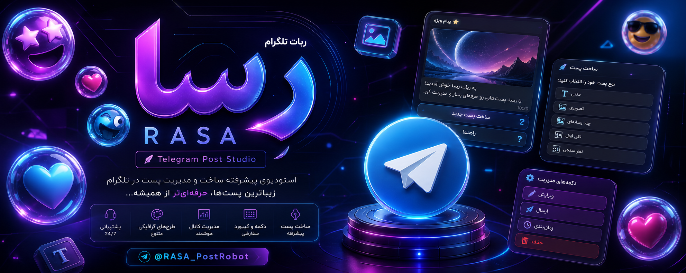
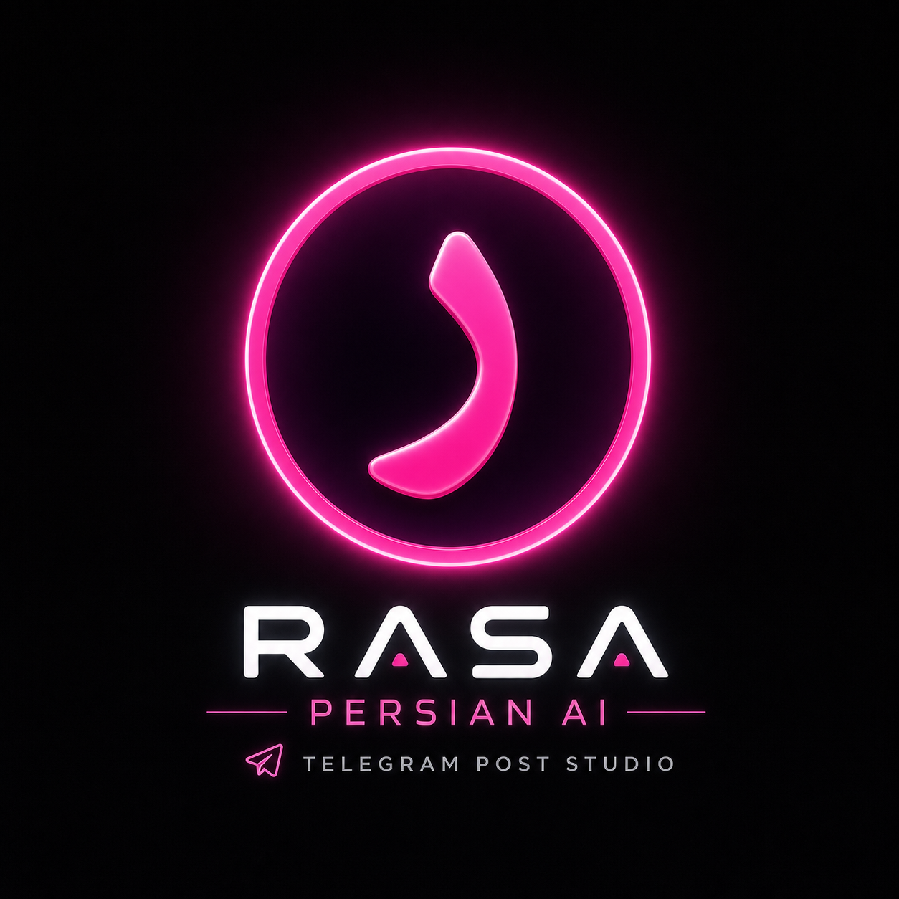
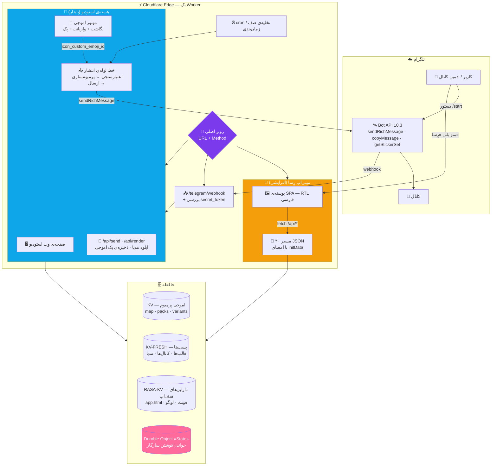
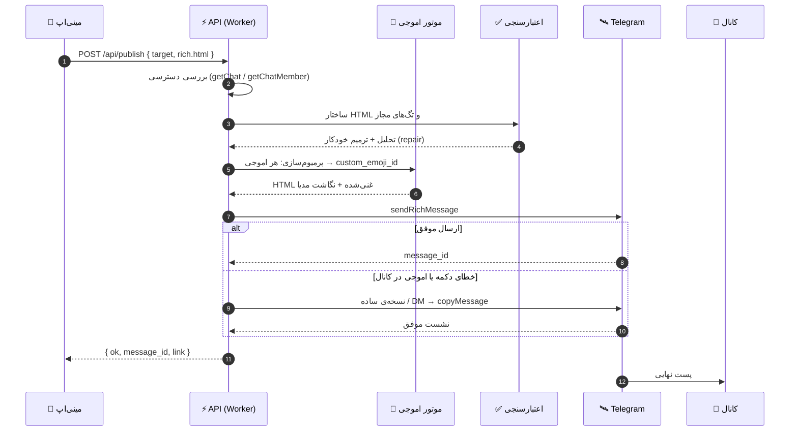
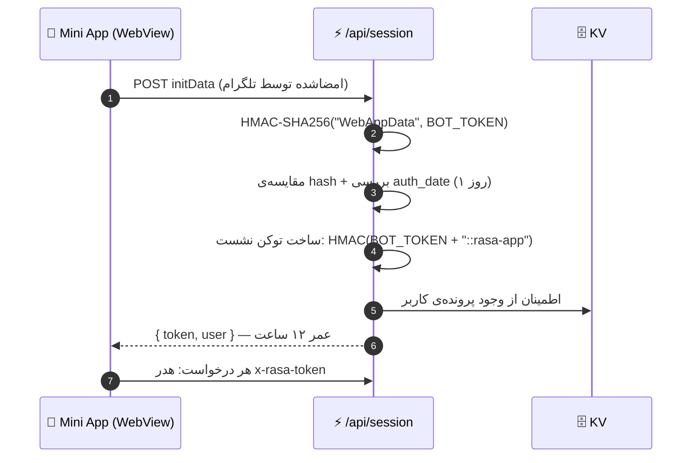
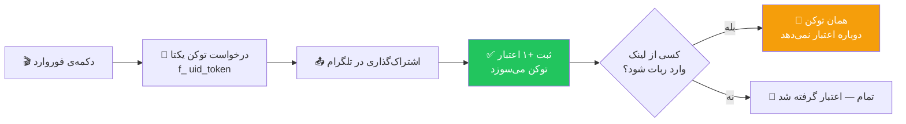

<div align="center">



<br/>



# رِسا — Rasa Studio

### استودیوی ساخت، طراحی و انتشار پست‌های ژورنالی تلگرام
**Telegram Rich Post Studio · Premium Emoji Engine · Mini App · on Cloudflare Workers**

<a href="https://t.me/RasaRichBot">
  
</a>
<a href="https://rich-post-bot.4lisarani-1.workers.dev/app">
  
</a>
<a href="./LICENSE">
  
</a>

<br/>


<br/><br/>


<br/>

[](#-رِسا-چیست) · [](#-english-overview) · [](#-معماری--architecture)

</div>

---

<div dir="rtl">

## 💎 رِسا چیست؟

**رِسا** یک استودیوی کامل برای ساختن **پست‌های ریچ تلگرام** است — همان پست‌هایی که در کانال‌ها با تیتر، جدول، نقل‌قول بازشونده، دکمه‌های شیشه‌ای، فرمول ریاضی و اموجی پرمیوم دیده می‌شوند.

کل سیستم روی **Cloudflare Workers** اجرا می‌شود: بدون سرور، بدون دیتابیس، بدون هزینه‌ی نگهداری. فقط یک ورکر، سه فضای KV و یک Durable Object.

دو رابط کاربری کاملاً مستقل روی یک ورکر سوار شده‌اند:

| | رابط | چه‌کار می‌کند |
|---|---|---|
| 🤖 | **ربات تلگرام** | ساخت پله‌پله‌ی پست با دکمه و راهنمای زنده، آپلود مدیا، ذخیره‌ی پک اموجی، انتشار در کانال |
| 📱 | **مینی‌اپ وب** (`/app`) | ادیتور بلوکی تصویری، پیش‌نمایش زنده، کتابخانه، زمان‌بندی، هوش مصنوعی، برند، دعوت دوستان |

> اصل معماری: لایه‌ی جدید **افزایشی** روی هسته‌ی پایدار سوار می‌شود. مسیرهای قدیمی دست‌نخورده می‌مانند (`/`, `/api/send`, `/webhook`) و رابط مینی‌اپ از مسیرهای خودش (`/app`, `/assets/*`, `/api/*`) سرو می‌شود. هیچ‌چیز نمی‌شکند، هیچ‌چیز دوباره نوشته نمی‌شود.

<div align="center">

**🔗 لینک‌های زنده**

ربات: [`t.me/RasaRichBot`](https://t.me/RasaRichBot) · مینی‌اپ: [`…workers.dev/app`](https://rich-post-bot.4lisarani-1.workers.dev/app)

</div>

---

## ✨ قابلیت‌ها — یک نگاه

</div>

<table>
<tr>
<td width="50%" valign="top">

<div dir="rtl">

### 🧱 ادیتور بلوکی
- **۱۵ نوع بلوک** در پالت: متن، عنوان، تصویر، جدول، فرمول، کارت محصول، جدول قیمت، تایمر آفری، نظرسنجی، نقل‌قول، بخش بازشونده، فهرست، دکمه، گروه دکمه، جداکننده
- جابه‌جایی بلوک‌ها، ویرایش درجا، حالت **HTML خام**
- پالت دستور (`Ctrl/⌘ + K`) + undo/redo
- تبدیل خودکار Markdown یا HTML یا متن قاطی → بلوک‌های ساخت‌یافته

</div>

</td>
<td width="50%" valign="top">

<div dir="rtl">

### 👁 پیش‌نمایش زنده
- رندر همان لحظه در شبیه‌ساز موبایل/دسکتاپ
- رنگ‌بندی واقعی تلگرام، حالت روشن و تاریک
- استفاده از صفحه‌کلید دکمه‌ها و آشکارسازی متن ریچ
- خروجی گرفتن سورس (HTML/Markdown) با یک کلیک

</div>

</td>
</tr>
<tr>
<td valign="top">

<div dir="rtl">

### 🍉 موتور اموجی پرمیوم
- **۱٬۶۰۰+ نگاشت اموجی** و **۲۵ پک** آماده
- جایگزینی هوشمند با درنظرگرفتن هر دو حالت `⚡` و `⚡️`
- نردبان امن برای کانال: پیام موقت در DM → `copyMessage` → انتشار (قانون Bot API 9.4)
- ذخیره‌ی پک جدید فقط با فوروارد یک استیکر به ربات

</div>

</td>
<td valign="top">

<div dir="rtl">

### 🔘 دکمه‌های ریچ
- دکمه‌ی شیشه‌ای داخل متن: `url` · `callback_data` · `copy_text` · `switch_inline_query` · `web_app` · `disabled`
- استایل‌ها: `primary` · `success` · `danger` · `link`
- سازنده‌ی دکمه با چیدمان راست/وسط/چپ و آیکن اموجی پرمیوم
- کیبورد اینلاین کلاسیک هم پشتیبانی می‌شود

</div>

</td>
</tr>
<tr>
<td valign="top">

<div dir="rtl">

### 🖼 کتابخانه‌ی رسانه
- آپلود از گالری گوشی، مستقیم از داخل مینی‌اپ
- فشرده‌سازی هوشمند عکس‌های سنگین (> ۸MB) قبل از ارسال
- استفاده‌ی مجدد از `file_id` — آپلود دوباره لازم نیست
- درج در پست، حذف، و مدیریت ویدیو/صدا/گیف

</div>

</td>
<td valign="top">

<div dir="rtl">

### 🗂 پیش‌نویس، قالب و آرشیو
- پیش‌نویس با **تگ**، **پوشه** و **ستاره**
- جستجو در عنوان/تگ/محتوای هر پیش‌نویس
- **۶ قالب آماده**: خوش‌آمد، پروموشن، آموزشی، گزارش، دکمه‌دار، مدیایی
- ذخیره‌ی قالب شخصی و بازیابی یک‌کلیکی

</div>

</td>
</tr>
<tr>
<td valign="top">

<div dir="rtl">

### ⏰ زمان‌بندی و انتشار
- انتخاب کانال از لیست (با بررسی خودکار دسترسی ربات)
- زمان‌بندی انتشار + حذف خودکار بعد از مدت مشخص
- صف کارها با تخلیه‌ی تنبل (lazy) و ایندکس جهانی برای cron
- انتشار با امضای «رِسا» یا بدون امضا (اعتبار)

</div>

</td>
<td valign="top">

<div dir="rtl">

### ✨ استودیوی هوش مصنوعی
- **۸ پرووایدر** آماده: Cloudflare Workers AI، Gemini، Groq، OpenRouter، Cerebras، Mistral، GitHub Models و هر سرویس سازگار با OpenAI
- کلید هر کاربر فقط در فضای خودش ذخیره می‌شود
- سبک‌های تولید: ویروسی، رسمی، محصولی، استاندارد
- انتخاب خودکار «مدل نویسنده» (مدل‌های دسته‌بندی و صوتی رد می‌شوند)

</div>

</td>
</tr>
<tr>
<td valign="top">

<div dir="rtl">

### 🎨 کیت برند
- رنگ، فوتر و استایل دکمه برای هر کانال
- اعمال یک‌کلیکی روی کل پست
- تا ۲۰ برند ذخیره‌شده در هر حساب

</div>

</td>
<td valign="top">

<div dir="rtl">

### 🎁 دعوت، اعتبار و اتصال کانال
- **لینک دعوت**: هر نفری که وارد شود → `+۲` برای تو و `+۲` برای خودش
- **لینک فوروارد**: هر فوروارد → `+۱` همان لحظه (بدون نیاز به ورود کسی)
- توکن یک‌بارمصرف ضدتکرار + سقف روزانه + فاصله‌ی زمانی
- اتصال کانال با فوروارد یک پست یا زدن `@username`

</div>

</td>
</tr>
</table>

<div dir="rtl">

---

## 🏗 معماری — Architecture

سه لایه، یک ورکر. هر لایه کار خودش را می‌کند و مرزهایشان دقیق است.



<div align="center">

### 🔀 نقشه‌ی مسیرها — Routing Map

</div>

| مسیر | روش | لایه | توضیح |
|---|---|:---:|---|
| `/` | GET | هسته | صفحه‌ی وب استودیو (نسخه‌ی تک‌فایلی) |
| `/worker.js` | GET | هسته | سورس ورکر برای مرجع |
| `/api/send` · `/api/render` | POST | هسته | ساخت و ارسال پست از وب |
| `/api/emoji/all` · `/api/emoji/img` | GET | هسته | ایندکس پک‌ها + پروکسی تصویر اموجی با کش لبه |
| `/telegram/webhook` | POST | هسته | دریافت آپدیت‌های تلگرام (بررسی هدر سکرت) |
| `/app` | GET | مینی‌اپ | پوسته‌ی SPA از `RASA_KV` |
| `/assets/*` | GET | مینی‌اپ | فونت، لوگو، تصویر و صدای برند با کش یک‌ساله |
| `/api/session` | POST | مینی‌اپ | تبدیل `initData` به توکن نشست ۱۲ساعته |
| `/api/context` | GET | مینی‌اپ | هیدراسیون اولیه: کانال، پیش‌نویس، قالب، مدیا |
| `/api/publish` | POST | مینی‌اپ | انتشار در کانال با بررسی دسترسی |
| `/api/media/*` | POST | مینی‌اپ | آپلود/حذف کتابخانه‌ی رسانه |
| `/api/draft/*` · `/api/template/*` | POST | مینی‌اپ | ذخیره، بازیابی، تگ، پوشه، قالب |
| `/api/brand/*` | POST | مینی‌اپ | کیت برند |
| `/api/schedule/*` | POST | مینی‌اپ | ساخت و مدیریت صف زمان‌بندی |
| `/api/ai/*` | POST | مینی‌اپ | تنظیم، تست و تولید با هوش مصنوعی |
| `/api/invite/*` | POST | مینی‌اپ | اعتبار، لینک دعوت و لینک فوروارد |
| `/api/channel/*` · `/api/import/*` | POST | مینی‌اپ | اتصال کانال و وارد کردن لینک |

---

## 🤖 چرخه‌ی حیات یک پست — Publish Pipeline

</div>



<div dir="rtl">

نکته‌ی مهم: **نردبان افتادن (fallback ladder)** بخش سختِ کار است. اگر کانال اجازه‌ی دکمه یا اموجی پرمیوم ندهد، سیستم به‌جای شکست، مرحله‌به‌مرحله سبک‌تر می‌شود تا پست برسد:

`sendRichMessage(کامل)` → `sendRichMessage(بدون آیکن دکمه)` → `نسخه‌ی ساده` → `DM + copyMessage`

---

## 🔐 امنیت و جریان احراز هویت



</div>

| لایه | مکانیزم |
|---|---|
| 📥 وبهوک | هدر `X-Telegram-Bot-Api-Secret-Token` با مقایسه‌ی زمان‌ثابت |
| 🔐 نشست مینی‌اپ | `initData` + HMAC-SHA256 روی `WebAppData`، سپس توکن ۱۲ساعته با کلید مشتق‌شده |
| 👮 دسترسی ادمین | `ADMIN_KEY` (Bearer) و لیست سفید `ADMINS_ID` |
| 🧼 اعتبارسنجی متن | تگ‌های مجاز، تحلیل ساختار، ترمیم خودکار قبل از ارسال |
| 🕵️ سوءاستفاده از اعتبار | توکن یک‌بارمصرف، سقف روزانه، فاصله‌ی زمانی، محافظت از خود-دعوت |
| 🔑 کلید هوش مصنوعی | فقط در فضای همان کاربر و صرفاً برای همان کاربر |

> ⚠️ **هیچ‌وقت توکن واقعی را در ریپو نگذارید.** تمام نمونه‌ها در این مستندات جای‌نگهدار هستند. اگر توکنی لو رفت، همان لحظه در BotFather با `/revoke` باطل کنید و سکرت‌های Worker را تازه کنید.

---

<div dir="rtl">

## 🧠 موتور اموجی پرمیوم

قلب زیبایی «رِسا» اینجاست: هر اموجیِ داخل متن، قبل از ارسال به یک **اموجی پرمیوم تلگرام** نگاشت می‌شود.

<br/>

**جریان داده:**

```
┌──────────────┐     فوروارد استیکر     ┌──────────────┐
│   کاربر      │ ─────────────────────▶ │   ربات       │
└──────────────┘                        └──────┬───────┘
                                               │ getStickerSet
                                               ▼
                                    ┌─────────────────────┐
                                    │  harvest(entities)   │
                                    │  اموجی → id          │
                                    └──────┬──────────────┘
                                           │  merge
                     ┌─────────────────────┴─────────────────────┐
                     ▼                                           ▼
          ┌───────────────────┐                     ┌────────────────────┐
          │  map              │                     │  variants_map      │
          │  ✍️ → 53…27313   │                     │  ✍️ → [id1, id2…] │
          └─────────┬─────────┘                     └──────────┬─────────┘
                    └───────────────┬───────────────────────────┘
                                    ▼
                        ┌───────────────────────┐
                        │  premiumize(html)     │
                        │  <tg-emoji id="…">    │
                        └───────────────────────┘
```

<br/>

| مفهوم | مقدار در نسخه‌ی زنده |
|---|---|
| نگاشت‌های اموجی | **۱٬۶۰۰+** ردیف |
| پک‌های شناسایی‌شده | **۲۵** پک |
| کدهای کوتاه سمت مینی‌اپ | **۴۹۳** ورودی + **۲۴۶** واریانت |
| پوشش دو حالت | `⚡` و `⚡️` جداگانه نگاشت می‌شوند |
| بافر لبه | `/api/emoji/img` با `immutable, max-age=31536000` |

---

## 📦 چه چیزی کجا ذخیره می‌شود؟ — Storage Map

</div>

| کلید | شکل | محل | مصرف |
|---|---|---|---|
| `map` · `packs` · `pkl` | JSON | KV | دیتابیس اموجی پرمیوم |
| `emoji:map` · `emoji:variants_map` | JSON | RASA-KV | ایندکس مینی‌اپ برای انتخابگر اموجی |
| `post:<id>` | JSON | KV-FRESH | بدنه‌ی پست‌های در حال ویرایش |
| `st:<uid>` | JSON | هر دو | وضعیت مکالمه‌ی کاربر در ربات |
| `d:<uid>:<id>` + `d:<uid>:index` | JSON | KV-FRESH | پیش‌نویس‌ها و ایندکس آن‌ها |
| `t:<uid>:<id>` | JSON | KV-FRESH | قالب‌های شخصی |
| `m:<uid>` | JSON | KV-FRESH | کتابخانه‌ی رسانه (`file_id`ها) |
| `appc:<uid>` | JSON | KV | کانال‌های وصل‌شده |
| `brand:<uid>` | JSON | KV | کیت‌های برند |
| `sched:<uid>` + `sched_global` | JSON | KV | صف زمان‌بندی |
| `ai_cfg:<uid>` | JSON | KV | کلید و مدل هوش مصنوعی هر کاربر |
| `invites:<uid>` | JSON | KV | اعتبار، دعوت‌ها، توکن‌های فوروارد |
| `ref:<uid>` · `fwd:<uid>` | JSON | KV | اثرانگشت یک‌بارمصرف دعوت/فوروارد |
| `asset:*` | binary | RASA-KV | `app.html`، فونت‌ها، لوگو، تصویر و صدای برند |

> الگوی نام‌گذاری عمداً ساده و قابل‌حدس است: `<نوع>:<شناسه>`. همین باعث می‌شود دیباگ روی نسخه‌های KV سریع باشد و مهاجرت داده ساده بماند.

---

<div dir="rtl">

## 🎁 سیستم اعتبار و دعوت

سه راه برای گرفتن اعتبار وجود دارد و همه‌شان ضدتکرار طراحی شده‌اند:

</div>

| مسیر | پاداش | شرط |
|---|---|---|
| 🔗 کسی با **لینک دعوت** (`start=ref_<uid>`) وارد شود | **+۲ برای تو، +۲ برای او** | کاربر واقعی، یک‌بار برای هر نفر |
| 📤 **فوروارد لینک** (`start=f_<uid>_<token>`) | **+۱ همان لحظه** | همین که بفرستی؛ لازم نیست کسی وارد شود |
| ✍️ ماندن امضای «رِسا» روی پست | **+۱ هر ۵ پست** | دکمه‌ی امضا حفظ شود |



<div dir="rtl">

و اگر تعداد اعتبار کافی باشد، می‌توانی پست را **بدون امضا** منتشر کنی: هر پست بدون امضا یک اعتبار مصرف می‌کند.

**تبدیل اعتبار به قدرت:** از تب «دوستان» می‌توانی اعتبار بگیری، از تب «انتشار» می‌توانی بی‌امضا بفرستی.

---

## 📱 معماری مینی‌اپ

مینی‌اپ یک **تک‌فایل HTML** است (بدون باندلر، بدون فریم‌ورک) که از KV سرو می‌شود:

</div>

```
miniapp/app.html
├── 🎨 استایل        متغیرهای CSS + تم تاریک/روشن + فونت وزیرمتن
├── 🧩 مدل بلاک      { id, type, … }  ← منبع حقیقت ادیتور
├── 🔁 سه مسیر تبدیل  بلاک ⇄ HTML ⇄ Markdown
├── 👁 رندرر پیش‌نمایش  شبیه‌ساز موبایل/دسکتاپ + دکمه‌ها
├── 🍉 انتخابگر اموجی  از ایندکس سرور + لود تدریجی
├── 🖼 خط لوله‌ی رسانه  فشرده‌سازی در مرورگر → FormData → file_id
├── ✨ پنل هوش مصنوعی  کلید، تست، انتخاب مدل، تولید
├── 🎁 پنل دوستان      لینک دعوت + لینک فوروارد + شمارنده
└── 🔌 لایه‌ی API       fetch + هدر x-rasa-token + مدیریت خطای فارسی
```

<div dir="rtl">

**اصول طراحی که رعایت شده:**

- **حالت نمایشی (demo) بدون سرور:** اگر اپ بیرون تلگرام باز شود، همه‌ی رابط کار می‌کند و فقط نوشتن روی سرور غیرفعال می‌شود.
- **پیام خطای انسانی:** هر خطای شبکه، حجم فایل، سقف تلگرام یا خطای پرووایدر به یک جمله‌ی فارسی قابل‌فهم تبدیل می‌شود.
- **بازخورد لمسی:** `HapticFeedback` روی اکشن‌های مهم.
- **کش‌شکنی هوشمند:** `app.html` با `no-store` سرو می‌شود تا آپدیت‌ها فوری بنشینند.

---

## 🧪 تست و کیفیت

</div>

```bash
cd worker
node test-integration.mjs     # 🧪 تست‌های یکپارچگی مسیرها و خط لوله‌ی انتشار
```

<div dir="rtl">

مجموعه‌ی تست‌ها این قراردادها را تضمین می‌کنند:

- ✅ مسیرهای هسته (`/`، `/api/send`، `/webhook`) بیت‌به‌بیت پایدار می‌مانند
- ✅ پوسته‌ی مینی‌اپ و دارایی‌هایش از KV سرو می‌شوند و نشست با `initData` نامعتبر رد می‌شود
- ✅ انتشار پرمیوم در کانال مسیر DM → `copyMessage` را می‌رود
- ✅ متن خراب قبل از رسیدن به تلگرام ترمیم یا حذف می‌شود
- ✅ اموجی کتابخانه در مسیر پیش‌نمایش به `tg-emoji` تبدیل می‌شود (و بلوک کد دست‌نخورده می‌ماند)
- ✅ هر توکن فوروارد فقط یک بار اعتبار می‌دهد
- ✅ مدل‌های دسته‌بندی/صوتی هرگز به‌عنوان «مدل نویسنده» انتخاب نمی‌شوند

---

## ⚙️ محدودیت‌ها — Limits

</div>

| مورد | سقف | منبع |
|---|---|---|
| متن پست ریچ | ۳۲٬۷۶۸ کاراکتر | Bot API |
| کپشن مدیا | ۱٬۰۲۴ کاراکتر | Bot API |
| عکس | ۱۰MB (فشرده‌سازی خودکار بالای ۸MB) | Bot API |
| ویدیو / صدا / گیف | ۵۰MB | Bot API |
| دسته‌ی کپشن | ۱۰۲۴ کاراکتر × ۱۰ | طراحی داخلی |
| پیش‌نویس | ۲۰ در هر حساب | طراحی داخلی |
| قالب شخصی | ۳۰ در هر حساب | طراحی داخلی |
| برند | ۲۰ در هر حساب | طراحی داخلی |
| صف زمان‌بندی | ۵۰ کار در هر حساب | طراحی داخلی |
| اعتبار از فوروارد | ۲۰ در روز + فاصله‌ی ۱۰ ثانیه | ضدسوءاستفاده |

---

<div dir="rtl">

## 📁 ساختار پروژه

</div>

```
RasaRichBot/
├── 📄 README.md                  همین فایل
├── 🖼️ banner.png · logo.png       دارایی‌های برند
├── 📜 LICENSE                    MIT
├── 🔐 .dev.vars.example          نمونه‌ی متغیرهای محیطی (بدون مقدار واقعی)
│
├── ⚡ worker/
│   ├── index.js                  بسته‌ی نهایی ورکر (همان چیزی که دیپلوی می‌شود)
│   ├── wrangler.toml             بایندینگ‌های KV و Durable Object
│   ├── package.json
│   ├── test-integration.mjs      تست‌های یکپارچگی
│   └── src/
│       ├── glue.js               🚦 روتر افزایشی مینی‌اپ
│       ├── config.js             ⚙️ خواندن env و پرووایدرهای AI
│       ├── store.js              🗄 لایه‌ی حافظه (KV + ایندکس‌ها)
│       ├── telegram.js           🛰️ کلاینت Bot API
│       ├── miniapp.js            🔐 ۳۰ مسیر JSON با احراز هویت
│       ├── emoji/index.js        🍉 برداشت، نگاشت و پرمیوم‌سازی
│       ├── rich/
│       │   ├── kit.js            🧱 ساخت بلوک‌های ریچ
│       │   ├── validate.js       ✅ تحلیل، ترمیم و پاک‌سازی
│       │   └── send.js           📤 خط لوله‌ی انتشار
│       └── flows/library.js      📚 قالب‌های آماده
│
├── 📱 miniapp/
│   ├── app.html                  پوسته‌ی کامل استودیو (تک‌فایل)
│   └── assets/                   دارایی‌های سرو‌شده از KV
│
└── 📚 docs/
    ├── ARCHITECTURE.md           معماری کامل
    ├── MINIAPP.md                آناتومی مینی‌اپ
    ├── CREDITS.md                سیستم اعتبار و دعوت
    ├── EMOJI_ENGINE.md           موتور اموجی پرمیوم
    ├── RICH_BUTTONS.md           دکمه‌های ریچ و کدهای زبان
    └── DEPLOYMENT.md             استقرار، سکرت‌ها و برگرداندن نسخه
```

---

<div dir="rtl">

## ⚡ راه‌اندازی سریع

### ۱️⃣ دریافت کد

```bash
git clone https://github.com/Alisarani7021/RasaRichBot.git
cd RasaRichBot
```

### ۲️⃣ ساخت ربات

در [@BotFather](https://t.me/BotFather): `/newbot` → نام و یوزرنیم دلخواه → توکن را نگه دار.

سپس تنظیمات ظاهر:

```
/setdescription  🌟 رِسا — استودیوی ساخت پست‌های ژورنالی تلگرام
/setabouttext    Rich posts · Premium emoji · Mini App · on Cloudflare
/setcommands     start - شروع · app - مینی‌اپ · post - استودیو · guide - راهنما
```

و در **Bot Settings → Menu Button** آدرس مینی‌اپ را بگذار: `https://<worker-domain>/app`

### ۳️⃣ سکرت‌ها

```bash
cp .dev.vars.example .dev.vars
# مقادیر را فقط داخل .dev.vars بگذارید — این فایل در .gitignore است
```

| متغیر | نوع | نقش |
|---|---|---|
| `BOT_TOKEN` | سکرت | توکن ربات از BotFather |
| `WEBHOOK_SECRET` | سکرت | رشته‌ی تصادفی؛ همان `secret_token` وبهوک |
| `ADMIN_KEY` | سکرت (اختیاری) | توکن اپراتور برای مسیرهای مدیریتی |
| `ADMINS_ID` | متن (اختیاری) | لیست سفید شناسه‌های مدیر |
| `WEBHOOK_PATH` | متن | پیش‌فرض `/telegram/webhook` |

### ۴️⃣ دیپلوی

```bash
cd worker
npx wrangler deploy
```

یا با API چندبخشی (روشی که سکرت‌ها را دست‌نخورده نگه می‌دارد):

```bash
curl -X PUT \
  "https://api.cloudflare.com/client/v4/accounts/$ACCOUNT_ID/workers/scripts/rich-post-bot" \
  -H "Authorization: Bearer $CLOUDFLARE_API_TOKEN" \
  -F 'metadata={"main_module":"index.js","compatibility_date":"2026-09-28",
       "keep_bindings":["secret_text"],
       "bindings":[ ... همان بایندینگ‌های wrangler.toml ... ]};type=application/json' \
  -F "index.js=@worker/index.js;type=application/javascript+module"
```

> 💡 کلید `keep_bindings: ["secret_text"]` باعث می‌شود `BOT_TOKEN`، `WEBHOOK_SECRET` و `ADMIN_KEY` بعد از هر آپدیت سرجایشان بمانند — بدون آن، هر دیپلوی سکرت‌ها را پاک می‌کند.

### ۵️⃣ ثبت وبهوک

```bash
curl -X POST "https://api.telegram.org/bot$BOT_TOKEN/setWebhook" \
  -H "Content-Type: application/json" \
  -d '{"url":"https://<worker-domain>/telegram/webhook",
       "secret_token":"<WEBHOOK_SECRET>",
       "allowed_updates":["message","callback_query","my_chat_member"]}'
```

### ۶️⃣ آپلود دارایی‌های مینی‌اپ

پوسته و دارایی‌ها از KV خوانده می‌شوند؛ کافی است کلیدها را بنویسید:

```bash
curl -X PUT "$CF_API/accounts/$ACCOUNT_ID/storage/kv/namespaces/$RASA_KV/values/asset%3Aapp.html" \
  -H "Authorization: Bearer $CLOUDFLARE_API_TOKEN" \
  --data-binary @miniapp/app.html
```

### ۷️⃣ بررسی سلامت

```bash
curl -I https://<worker-domain>/            # 200 → صفحه‌ی استودیو
curl -I https://<worker-domain>/app         # 200 → مینی‌اپ
curl -X POST https://<worker-domain>/api/session   # 401 → احراز هویت فعال است ✅
```

</div>

---

## 🌍 English Overview

**Rasa** is a production-grade **Telegram Rich Post Studio** that runs entirely on **Cloudflare Workers** — no servers, no databases, no build step.

It ships two interfaces on a single worker:

- 🤖 **Bot interface** — a step-by-step post builder in Telegram with live previews, media upload, premium-emoji harvesting and channel publishing.
- 📱 **Mini App** (`/app`) — a Persian-first SPA with a block editor, live preview, media library, drafts, scheduling, brand kits, AI studio and a referral/credits system.

### Highlights

| Area | What makes it interesting |
|---|---|
| 🍉 **Emoji engine** | Harvests `custom_emoji` entities from forwarded stickers, keeps base + VS16 variants, and rewrites plain emoji into `<tg-emoji>` before publishing. |
| 🔘 **Rich buttons** | Full support for Bot API 9.4+ inline button styles and 10.3 rich-button rows, with a 4-step degradation ladder so a post always lands. |
| 🔐 **Auth** | Telegram `initData` verified with HMAC-SHA256, exchanged for a 12-hour session token signed with a derived key. |
| 🗄 **Storage** | Three KV namespaces for different lifecycles plus a Durable Object for consistent state reads, with a flat, predictable key scheme. |
| ⏰ **Scheduling** | Per-user job queues with a global index, drained lazily and by cron — no external scheduler service. |
| ✨ **AI studio** | Bring-your-own-key across 8 OpenAI-compatible providers, with server-side model hygiene so text classifiers can never be selected as writers. |
| 🎁 **Credits** | Single-use forward tokens give +1 credit the moment a link is shared, while staying duplicate-proof and rate limited. |

### Quick start

```bash
git clone https://github.com/Alisarani7021/RasaRichBot.git && cd RasaRichBot
cp .dev.vars.example .dev.vars      # fill in BOT_TOKEN + WEBHOOK_SECRET
cd worker && npx wrangler deploy
```

Full deployment guide: [`docs/DEPLOYMENT.md`](./docs/DEPLOYMENT.md) · Architecture: [`docs/ARCHITECTURE.md`](./docs/ARCHITECTURE.md)

---

<div dir="rtl">

## 🛣 نقشه‌ی راه

- [x] استودیوی پست + موتور اموجی پرمیوم + دکمه‌های ریچ
- [x] مینی‌اپ تصویری با احراز هویت تلگرام
- [x] کتابخانه‌ی رسانه با آپلود مستقیم و فشرده‌سازی
- [x] زمان‌بندی، کیت برند، وارد‌کردن لینک
- [x] استودیوی هوش مصنوعی چندپرووایدری
- [x] سیستم اعتبار، دعوت و فوروارد
- [ ] نظرسنجی و کوییز تعاملی در پست
- [ ] آمار بازدید پست‌ها و A/B تست تیتر
- [ ] حالت تیمی: چند ادمین روی یک کانال با نقش‌های جدا
- [ ] خروجی PDF/تصویر از پیش‌نمایش پست

---

## ❓ پرسش‌های پرتکرار

<details>
<summary><b>چرا Cloudflare Workers و نه یک VPS؟</b></summary>
<br/>
چون این پروژه ماهیت «همیشه روشن، کم‌ترافیک و پرتعداد ریکوئست کوچک» دارد. ورکر در لبه اجرا می‌شود، پلن رایگانش برای یک ربات پرمصرف کافی است و هیچ سروری برای پچ‌زدن امنیتی نداری.
</details>

<details>
<summary><b>داده‌ها کجا ذخیره می‌شوند؟ کسی به آن‌ها دسترسی دارد؟</b></summary>
<br/>
همه‌چیز در فضای KV و Durable Object خودت است؛ کلیدهای API کاربران هم فقط در فضای خودشان ذخیره می‌شود. هیچ درخواستی به سرور واسط فرستاده نمی‌شود.
</details>

<details>
<summary><b>اموجی پرمیوم در کانال کار نمی‌کند — مشکل چیست؟</b></summary>
<br/>
قانون Bot API 9.4: کانال‌ها اموجی پرمیوم را فقط از راه کپی از یک DM می‌پذیرند. ربات این را خودکار انجام می‌دهد؛ فقط کافی است یک‌بار به ربات `/start` داده باشی تا DM باز شود.
</details>

<details>
<summary><b>اگر پست با دکمه ارسال نشد چه می‌شود؟</b></summary>
<br/>
نردبان fallback خودکار عمل می‌کند: نسخه‌ی بدون آیکن دکمه، بعد نسخه‌ی ساده، بعد DM + کپی. پست همیشه منتشر می‌شود.
</details>

<details>
<summary><b>چطور مدل هوش مصنوعی را عوض کنم؟</b></summary>
<br/>
در تب «هوش مصنوعی» کلید و آدرس سرویس سازگار با OpenAI را وارد کن و «تست اتصال» را بزن. سرور لیست مدل‌ها را می‌خواند، مدل‌های غیرنویسنده را رد می‌کند و مناسب‌ترین را انتخاب و ذخیره می‌کند.
</details>

<details>
<summary><b>می‌توانم بدون امضای «رِسا» منتشر کنم؟</b></summary>
<br/>
بله. یا ۵ پست با امضا منتشر کن تا یک اعتبار بگیری، یا از دوستانت دعوت کن. هر پست بدون امضا یک اعتبار مصرف می‌کند.
</details>

---

## 🤝 مشارکت

هر ایده، گزارش باگ یا پول‌ریکوئست خوش‌آمد است:

1. یک برنچ تازه بساز: `git checkout -b feature/نام-قابلیت`
2. تغییر را با یک پیام کامیت گویا ثبت کن
3. پول‌ریکوئست بزن و رفتار قبل/بعد را توضیح بده

اگر می‌خواهی قابلیت تازه‌ای اضافه کنی، پیشنهاد می‌کنم اول در [`docs/ARCHITECTURE.md`](./docs/ARCHITECTURE.md) بخوانی که لایه‌ها کجا از هم جدا می‌شوند — رعایت همان مرزها کار را چند برابر ساده‌تر می‌کند.

---

## 📄 مجوز

این پروژه زیر مجوز **MIT** منتشر شده است — می‌توانی آزادانه استفاده، تغییر و توزیع کنی. متن کامل: [`LICENSE`](./LICENSE)

</div>

<div align="center">

<br/>

**ساخته‌شده برای کانال‌هایی که محتوا را جدی می‌گیرند**

<a href="https://t.me/RasaRichBot">
  
</a>
<a href="https://rich-post-bot.4lisarani-1.workers.dev/app">
  
</a>
<a href="https://github.com/Alisarani7021/RasaRichBot/stargazers">
  
</a>

<br/><br/>


<br/>

<sub>ساخته‌شده توسط <a href="https://github.com/Alisarani7021">@Alisarani7021</a> · <code>رِسا</code> ❤️ تلگرام</sub>

<br/><br/>

</div>
