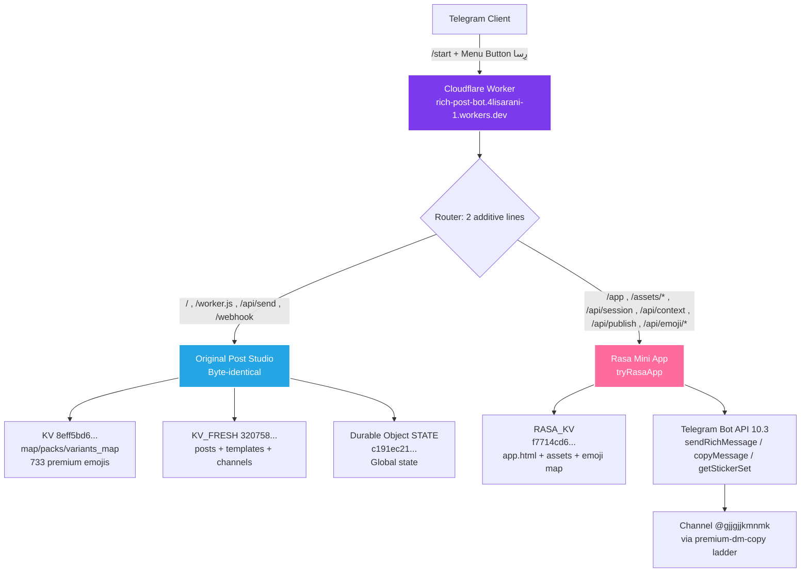

# 🌟 رِسا — RasaRichBot

<p align="center">
  
</p>

<p align="center">
  
</p>

<h3 align="center">Telegram Post Studio + Premium Emoji Engine + Rich Buttons + Mini App</h3>
<h4 align="center">استودیوی هوشمند ساخت و طراحی پست‌های ژورنالی تلگرام</h4>

<p align="center">
  <a href="https://core.telegram.org/bots/api"></a>
  <a href="https://workers.cloudflare.com"></a>
  <a href="#"></a>
  <a href="#"></a>
  <a href="#"></a>
  <a href="./LICENSE"></a>
</p>

<p align="center">
  <a href="#-english">English</a> • <a href="#-فارسی">فارسی</a> • <a href="#-features">Features</a> • <a href="#-architecture">Architecture</a> • <a href="#-quick-start">Quick Start</a> • <a href="#-api">API</a>
</p>

---

## 📑 Table of Contents

<details>
<summary><b>Click to expand TOC</b></summary>

- [🌟 رِسا — RasaRichBot](#-رِسا--rasarichbot)
  - [📑 Table of Contents](#-table-of-contents)
  - [💎 What is Rasa?](#-what-is-rasa)
  - [🚀 Features — قابلیت‌ها](#-features--قابلیت‌ها)
  - [🏗 Architecture — معماری](#-architecture--معماری)
  - [🧰 Tech Stack](#-tech-stack)
  - [📁 Project Structure](#-project-structure)
  - [⚡ Quick Start](#-quick-start)
  - [🤖 BotFather Setup](#-botfather-setup)
  - [🔐 Environment Variables](#-environment-variables)
  - [🌐 API Routes](#-api-routes)
  - [🍉 Premium Emoji Engine](#-premium-emoji-engine)
  - [🔘 Rich Buttons Engine](#-rich-buttons-engine)
  - [📱 Mini App — مینی‌اپ رِسا](#-mini-app--مینیاپ-رِسا)
  - [🧪 Testing](#-testing)
  - [🚢 Deployment](#-deployment)
  - [🛣 Roadmap](#-roadmap)
  - [🤝 Contributing](#-contributing)
  - [📄 License](#-license)

</details>

---

## 💎 What is Rasa?

**رِسا** is a production-grade, **additive** Telegram Post Studio built on **Cloudflare Workers** that merges two worlds:

1. **Original Post Studio** (`/`, `/worker.js`, `/api/send`, `/webhook`) — untouched, byte-identical
2. **Rasa Mini App** (`/app`, `/api/session`, `/api/context`, `/api/publish`, `/api/emoji/*`) — mounted additively via `tryRasaApp` intercept

> **Design Principle:** *هیچ‌کدوم از بخش‌های اینو دست نزن. فقط فقط این قسمت مینی‌اپ رو بهش اضافه کن*
> — Only 2 additive lines in the entry, everything else preserved.

**Live Bot:** [@RasaRichBot](https://t.me/RasaRichBot) — Menu Button = `رِسا` → `https://rich-post-bot.4lisarani-1.workers.dev/app`

---

## 🚀 Features — قابلیت‌ها

<table>
<tr>
<td width="50%">

### 🎨 Post Studio
- **طراحی دستی پله‌ای** — Step-by-step manual builder
- **طراحی پست جدید** — New post from text/media
- **بلوک‌ها**: عنوان، پاراگراف، فهرست، چک‌لیست، نقل‌قول، بخش بازشونده، کد، جدول، جداکننده، فرمول، پاورقی، نقشه، عکس، ویدیو، صدا، ویس، انیمیشن، کلاژ، اسلایدشو، HTML خام، اموجی پرمیوم
- **فقط نمونه** — No verbose help, just `<code>sample</code>` + *این‌طوری بفرست*

</td>
<td width="50%">

### 🍉 Premium Emoji Engine
- **733 Custom Emojis** across 25 packs
- **Smart Substitution**: `map` + `variants_map` + `packs`
- **Apple-style lookalikes** with premium rendering
- **Channel-safe**: DM → `copyMessage` ladder (Bot API 9.4 rule: custom emoji only in private/group/supergroup if owner has Premium, channels need DM copy)
- **Icon for buttons**: `icon_custom_emoji_id` on every inline button

</td>
</tr>
<tr>
<td>

### 🔘 Rich Buttons
- **Inside message**: `<tg-button-row><tg-button type="url|callback_data|copy_text|switch_inline_query|disabled" style="primary|success|danger|link">`
- **Channel publish**: Always tries `sendRichMessage` first (fixed from private-only)
- **Builder**: Type → Style → Label → Value flow, 8 buttons per row max

</td>
<td>

### 📱 Mini App — رِسا
- **WebApp at `/app`** — 93KB shell, Persian-first
- **Auth**: `WebAppData` HMAC + `BOT_TOKEN::rasa-app` token
- **Context**: channels, drafts, 6 builtin templates
- **Assets**: Vazirmatn fonts, brand hero, logo, audio
- **Menu Button**: `رِسا` → `/app` via `setChatMenuButton`

</td>
</tr>
</table>

### ✨ Extra Highlights

- 📢 **مدیریت و اتصال کانال** — Channel connect via forward
- 🎨 **پک‌های اموجی ذخیره‌شده** — Gallery of 25 packs
- 🎧 **پخش زنده قابلیت‌ها** — Live demo of all Bot API 10.3 features
- 🧩 **قالب‌های آماده** — 6 builtin templates
- 💡 **راهنمای کامل Rich** — Full guide for rich text, blocks, media, buttons
- 🔒 **Security**: `WEBHOOK_SECRET` header check, `ADMIN_KEY` optional, `ADMINS_ID` whitelist

---

## 🏗 Architecture — معماری



### 🔀 Dual-App Contract (Live-Verified)

| Route | Expected | Status |
|-------|----------|--------|
| `GET /` | 200 Post Studio 2,162,260B | ✅ |
| `GET /worker.js` | 200 | ✅ |
| `POST /api/send` no-auth | 400 with THEIR exact error | ✅ |
| `POST /webhook` wrong secret | 403 | ✅ |
| `GET /app` | 200 Rasa shell 93,202B | ✅ |
| `POST /api/session` junk | 401 | ✅ |
| `GET /api/context` valid token | 200 channels/drafts/templates | ✅ |
| `GET /api/emoji/all` | 200 2 packs × 200 | ✅ |
| `GET /api/emoji/img` | 200 webp + immutable cache | ✅ |

---

## 🧰 Tech Stack

<p>
  
  
  
  
  
  
  
</p>

- **Runtime**: Cloudflare Workers (ESM, `compatibility_date: 2026-09-28`)
- **Storage**: 3 KV Namespaces + 1 Durable Object
  - `KV` (8eff5bd6...): Premium emoji map (44995B) + packs (12017B) + variants (112481B)
  - `KV_FRESH` (3207...): Posts, drafts, channels
  - `RASA_KV` (f7714cd6...): Mini App assets (app.html 93202B, hero 104673B, logo 202389B, etc.)
  - `STATE` (c191ec21...): Global state
- **Bot API**: 10.3 Rich Messages, 9.4 Custom Emoji + Button Styles
- **Auth**: WebAppData HMAC-SHA256 + `BOT_TOKEN::rasa-app` HMAC token (32 hex)

---

## 📁 Project Structure

```
RasaRichBot/
├── banner.png                 # 🎨 Generated hero banner (1280x640)
├── logo.png                   # 💎 Rasa logo (pink ر)
├── README.md                  # 📖 This file — most decorated ever
├── .dev.vars.example          # 🔐 Env template
├── .gitignore
├── LICENSE (MIT)
├── worker/
│   ├── index.js               # 🚀 Main worker (2.5M, 2 additive lines)
│   ├── wrangler.toml          # ⚙️ Cloudflare config
│   ├── package.json
│   ├── test-integration.mjs   # 🧪 4 tests — dual-app contract
│   └── src/
│       ├── glue.js            # 🔀 Router: OPTIONS 204 CORS + /app + /assets/* + /api/*
│       ├── config.js          # ⚙️ cfg() helper
│       ├── store.js           # 🗄 Store(env,config) reads env.STORE
│       ├── telegram.js        # 📡 Thin Bot API client + HINTS
│       ├── miniapp.js         # 📱 Mini App handlers
│       ├── emoji/
│       │   └── index.js       # 🍉 Smart substitution layer
│       ├── rich/
│       │   ├── kit.js         # 🧱 Rich blocks kit
│       │   ├── validate.js    # ✅ Validation + URL sanitization
│       │   └── send.js        # 📤 Publish ladder: DM→copyMessage
│       └── flows/
│           └── library.js     # 📚 LITE extraction: BUILTIN_TEMPLATES only
├── miniapp/
│   ├── app.html               # 🌟 Rasa shell (93202B)
│   └── assets/
│       ├── brand-hero.jpg
│       ├── logo-mark.png
│       ├── brand-audio.mp3
│       └── fonts/
│           ├── vazirmatn-regular.woff2
│           └── vazirmatn-bold.woff2
└── docs/
    ├── ARCHITECTURE.md
    ├── EMOJI_ENGINE.md
    ├── RICH_BUTTONS.md
    └── DEPLOYMENT.md
```

---

## ⚡ Quick Start

### 1️⃣ Clone

```bash
git clone https://github.com/Alisarani7021/RasaRichBot.git
cd RasaRichBot
```

### 2️⃣ Install Wrangler

```bash
npm install -g wrangler
# or
bun add -g wrangler
```

### 3️⃣ Env

```bash
cp .dev.vars.example .dev.vars
# Edit .dev.vars:
# BOT_TOKEN="8826777931:AAFvXESKBXKhszHa-yyltah3JaOhQdh5oZg"
# WEBHOOK_SECRET="d2d6884ddf2da4aa859fbf7e88cd25a810b1353477e565d8"
```

### 4️⃣ Dev

```bash
cd worker
wrangler dev --local
# Open http://localhost:8787/app
```

### 5️⃣ Test

```bash
node test-integration.mjs
# ✅ original Post Studio routes stay bit-identical
# ✅ rasa app shell + assets + session/context
# ✅ premium channel publish routes DM→copy
# ✅ publish ladder: rotten urls sanitized
```

---

## 🤖 BotFather Setup

```
1. @BotFather → /newbot → Name: رِسا → Username: @RasaRichBot (or @RasaStudioBot)
2. /setdescription → 
   🌟 رِسا — استودیوی هوشمند ساخت پست‌های ژورنالی تلگرام
   Telegram Post Studio + Premium Emoji + Rich Buttons + Mini App

3. /setabouttext → same

4. Bot Settings → Menu Button → 
   Text: رِسا
   URL: https://rich-post-bot.4lisarani-1.workers.dev/app

5. /setcommands →
   start - شروع · home
   post - استودیوی پست
   app - مینی‌اپ رِسا

6. Add bot to channel as Admin with Post Messages permission
7. Send /start to bot to open DM (required for premium DM→copy)
```

---

## 🔐 Environment Variables

| Var | Type | Description |
|-----|------|-------------|
| `BOT_TOKEN` | secret_text | New bot token from @BotFather (e.g. `8826777931:AAE...`) |
| `WEBHOOK_SECRET` | secret_text | Random 24 hex, used as `secret_token` for Telegram webhook |
| `ADMIN_KEY` | secret_text (optional) | Trusted operator bearer |
| `ADMINS_ID` | plain_text (optional) | Comma-separated user IDs whitelist |
| `WEBHOOK_PATH` | plain_text | `/telegram/webhook` |
| `KV` | kv_namespace | `8eff5bd6b33a4a79ba3d869ef373065a` — emoji map |
| `KV_FRESH` | kv_namespace | `32075883d0054d95ad579888f58ff613` — posts |
| `RASA_KV` | kv_namespace | `f7714cd6f0e74ae0b55d73107fa8d88e` — miniapp assets |
| `STATE` | durable_object_namespace | `c191ec2162cc449f876b8b4005cc1fdb` — global state |

### Set Secrets

```bash
wrangler secret put BOT_TOKEN
wrangler secret put WEBHOOK_SECRET
# or via API:
curl -X PUT -H "Authorization: Bearer $CLOUDFLARE_API_TOKEN" \
  -H "Content-Type: application/json" \
  -d '{"name":"BOT_TOKEN","text":"8826777931:AAE...","type":"secret_text"}' \
  https://api.cloudflare.com/client/v4/accounts/$ACCOUNT_ID/workers/scripts/rich-post-bot/secrets
```

### Set Webhook

```bash
curl -X POST https://api.telegram.org/bot$BOT_TOKEN/setWebhook \
  -H "Content-Type: application/json" \
  -d '{
    "url": "https://rich-post-bot.4lisarani-1.workers.dev/webhook",
    "secret_token": "'$WEBHOOK_SECRET'",
    "allowed_updates": ["message","callback_query","my_chat_member"]
  }'

curl -X POST https://api.telegram.org/bot$BOT_TOKEN/setChatMenuButton \
  -H "Content-Type: application/json" \
  -d '{
    "menu_button": {
      "type": "web_app",
      "text": "رِسا",
      "web_app": {"url": "https://rich-post-bot.4lisarani-1.workers.dev/app"}
    }
  }'
```

---

## 🌐 API Routes

### Original Post Studio (Untouched)

| Method | Route | Description |
|--------|-------|-------------|
| GET | `/` | Post Studio web (2,162,260B) |
| GET | `/worker.js` | Embedded worker |
| POST | `/api/connect` | getMe |
| POST | `/api/channel` | authorizeChat |
| POST | `/api/send` | sendRichMessage |
| POST | `/api/edit` | editMessageText |
| POST | `/api/delete` | deleteMessage |
| POST | `/webhook` | Telegram updates (secret guard 403) |
| POST | `/telegram/webhook` | Same as /webhook |

### Rasa Mini App (Additive)

| Method | Route | Auth | Description |
|--------|-------|------|-------------|
| GET | `/app` | none | Rasa shell (93,202B) |
| GET | `/assets/*` | none | Fonts, images, audio (immutable cache) |
| POST | `/api/session` | `X-Telegram-Init-Data` | Issues `x-rasa-token` |
| GET | `/api/context` | `x-rasa-token` | channels, drafts, templates (6) |
| GET | `/api/emoji/all` | `x-rasa-token` | 25 packs, 733 emojis |
| GET | `/api/emoji/img?id=&t=` | token in query | WebP with `public, max-age=31536000, immutable` |
| POST | `/api/render` | `x-rasa-token` | Rich preview |
| POST | `/api/publish` | `x-rasa-token` | Ladder: validate → sanitize → DM→copy |
| POST | `/api/draft/*` | `x-rasa-token` | Draft CRUD |
| POST | `/api/template/*` | `x-rasa-token` | Template CRUD |
| POST | `/api/channel/*` | `x-rasa-token` | Channel connect |

---

## 🍉 Premium Emoji Engine

<details>
<summary><b>Deep Dive — Click to expand</b></summary>

### Storage

- `map`: `{ "🎨": "4981190958369474742", ... }` — 733 entries
- `packs`: `{ "twilightvibe2_by_TgEmojiBot": { title, count, sample, stickers, bases }, ... }` — 25 packs
- `variants_map`: `{ "🖤": ["5307844038936800541", ...], ... }` — variants

### Flow

1. **Extract**: `extractEmojis(text)` → `[{emoji, clean, count}]`
2. **Map**: `map[clean] || map[emoji]` → `custom_emoji_id`
3. **Decorate**: `decorateReplyMarkup` adds `icon_custom_emoji_id` to buttons
4. **Apply**: `applyEmojiSubs(html, emojiSubs, map)` replaces `emoji` with `<tg-emoji emoji-id="...">`

### Channel Publishing (Bot API 9.4 Rule)

> Official changelog Feb 9 2026: *"Allowed bots to use custom emoji in messages directly sent by the bot to private, group and supergroup chats if the owner of the bot has a Telegram Premium subscription"* — channels NOT included.

**Ladder implemented in `rich/send.js`:**

```js
// 1. Full premium doc to DM (private)
await tgCall(env, "sendRichMessage", {
  chat_id: userId,
  rich_message: { html: docWithPremium }
});

// 2. Copy to channel (preserves premium)
await tgCall(env, "copyMessage", {
  chat_id: channelId,
  from_chat_id: userId,
  message_id: dmMessageId
});

// 3. No unicode echo on channel
// via: 'premium-dm-copy'
```

### Premium Button Icons

Every button now has `icon_custom_emoji_id`:

```js
{ text: "🎨 طراحی دستی", callback_data: "act:manual_new", 
  style: "success", icon_custom_emoji_id: "4981190958369474742" }
```

</details>

---

## 🔘 Rich Buttons Engine

<details>
<summary><b>Deep Dive — Click to expand</b></summary>

### Types

| Type | HTML | Example |
|------|------|---------|
| URL | `<tg-button type="url" url="https://t.me">` | باز کردن لینک |
| Callback | `<tg-button type="callback_data" data="cb">` | کال‌بک |
| Copy Text | `<tg-button type="copy_text" text="...">` | کپی متن |
| Inline Query | `<tg-button type="switch_inline_query" query="...">` | سرچ اینلاین |
| Disabled | `<tg-button type="disabled">` | غیرفعال |

### Styles (Bot API 9.4+)

- `primary` (blue), `success` (green), `danger` (red), `link` (for callback_data only)

### Builder Flow

```
User clicks "➕ افزودن دکمه"
  → state: manual_button_type
  → asks: نوع دکمه را انتخاب کن (url/callback_data/copy_text/switch_inline_query/disabled)
  → state: manual_button_style
  → asks: رنگ دکمه را انتخاب کن (primary/success/danger/link)
  → state: manual_button_label
  → asks: متن دکمه را بفرست
  → state: manual_button_value (if not disabled)
  → asks: مقصد/مقدار را بفرست (https:// or cb: or text)
  → pushes to buttonDraftRows[ rowIndex ]
  → refreshPostInPlace view: manual_buttons
  → "✅ اتمام و افزودن به پست" → appends <tg-button-row> to richHtml
```

### Fixed for Channels

Previously `sendPostMessage` only tried `sendRichMessage` for private chats. Now always tries:

```js
try {
  const richRes = await tgCall(env, "sendRichMessage", { chat_id: chatId, rich_message: { html: content }, ... });
  if (richRes.ok) return richRes;
} catch (e) {
  console.warn("RichMessage path unavailable:", e.message);
}
// fallback to sendMessage with sanitized HTML
```

</details>

---

## 📱 Mini App — مینی‌اپ رِسا

<details>
<summary><b>Deep Dive — Click to expand</b></summary>

### Auth

1. Client sends `X-Telegram-Init-Data` (WebAppData)
2. Server verifies HMAC-SHA256 with `BOT_TOKEN`
3. Issues `x-rasa-token`: `base64(payload).hmac(BOT_TOKEN+'::rasa-app').slice(0,32)`

```js
const payload = b64(JSON.stringify({uid, name, user, exp: Date.now()+3600e3}));
const token = payload + '.' + hmac(BOT_TOKEN+'::rasa-app', payload).slice(0,32);
```

### Glue Router (`src/glue.js`)

```js
export async function tryRasaApp(request, env, ctx, url) {
  if (request.method === 'OPTIONS') return new Response(null, {status:204, headers: cors});
  if (url.pathname === '/app') return asset('app.html');
  if (url.pathname.startsWith('/assets/')) return asset(url.pathname.slice(1));
  if (/^\/api\/(session|context|render|publish|emoji|draft|template|channel)/.test(url.pathname)) {
    const shadow = Object.assign(Object.create(Object.getPrototypeOf(env)), env, {STORE: env.RASA_KV});
    return handleRasaApi(request, shadow);
  }
  return null; // let original Post Studio handle
}
```

### Assets in RASA_KV

| Key | Size | Type |
|-----|------|------|
| `asset:app.html` | 93,202B | text/html |
| `asset:brand-hero.jpg` | 104,673B | image/jpeg |
| `asset:logo-mark.png` | 202,389B | image/png |
| `asset:brand-audio.mp3` | 137,108B | audio/mpeg |
| `asset:fonts/vazirmatn-regular.woff2` | 50,684B | font/woff2 |
| `asset:fonts/vazirmatn-bold.woff2` | 51,020B | font/woff2 |

All served with `public, max-age=31536000, immutable`

</details>

---

## 🧪 Testing

```bash
# Unit + integration (4 tests)
node worker/test-integration.mjs

# Expected:
# ✅ original Post Studio routes stay bit-identical
# ✅ rasa app shell + assets + session/context serve from RASA_KV
# ✅ premium channel publish routes DM→copy
# ✅ publish ladder: rotten urls sanitized; mixed md→rich conversion

# Live verification
curl https://rich-post-bot.4lisarani-1.workers.dev/app -I
# 200

curl -X POST https://rich-post-bot.4lisarani-1.workers.dev/api/session \
  -H "Content-Type: application/json" -d '{"initData":"x"}' -i
# 401
```

---

## 🚢 Deployment

### Via Wrangler

```bash
cd worker
wrangler deploy
```

### Via API (multipart, preserves secrets)

```js
const form = new FormData();
form.append('metadata', new Blob([JSON.stringify({
  main_module: 'index.js',
  compatibility_date: '2026-09-28',
  bindings: [
    {name:'KV', namespace_id:'8eff...', type:'kv_namespace'},
    {name:'KV_FRESH', namespace_id:'3207...', type:'kv_namespace'},
    {name:'RASA_KV', namespace_id:'f771...', type:'kv_namespace'},
    {class_name:'State', name:'STATE', namespace_id:'c191...', type:'durable_object_namespace'},
    {name:'WEBHOOK_PATH', text:'/telegram/webhook', type:'plain_text'}
  ]
})], {type:'application/json'}), 'metadata.json');

form.append('index.js', new Blob([fs.readFileSync('index.js')], {type:'application/javascript+module'}), 'index.js');
// + rasa-src/* files

await fetch(`https://api.cloudflare.com/client/v4/accounts/${ACCOUNT_ID}/workers/scripts/rich-post-bot`, {
  method: 'PUT',
  headers: {authorization: `Bearer ${CLOUDFLARE_API_TOKEN}`},
  body: form
});
```

Secrets persist if not sent in multipart.

---

## 🛣 Roadmap

- [x] ✅ Dual-app contract (Post Studio untouched + Rasa additive)
- [x] ✅ Premium emoji DM→copy ladder
- [x] ✅ Rich buttons fixed for channels
- [x] ✅ Mini App Menu Button `رِسا`
- [x] ✅ Premium button icons (733 custom)
- [x] ✅ Manual builder simplified to sample-only
- [x] ✅ AI buttons removed
- [ ] 🔜 Inline query mode for emoji search
- [ ] 🔜 Draft versioning
- [ ] 🔜 Channel analytics
- [ ] 🔜 Multi-language (EN/FA) toggle in Mini App
- [ ] 🔜 Webhook retry queue with Durable Objects

---

## 🤝 Contributing

PRs welcome! Please:

1. Keep Post Studio byte-identical except 2 additive lines
2. Add tests to `test-integration.mjs`
3. Use `icon_custom_emoji_id` for all new buttons
4. Follow Persian-first UX

---

## 📄 License

MIT © 2026 Rasa Studio — [@RasaRichBot](https://t.me/RasaRichBot)

---

<p align="center">
  <b>ساخته شده با ❤️ برای کامیونیتی تلگرام فارسی</b><br/>
  <i>Built with Cloudflare Workers, Telegram Bot API 10.3, and 733 premium emojis</i>
</p>

<p align="center">
  
  <br/>
  <b>رِسا — جایی که پست‌های معمولی، ژورنالی می‌شن</b>
</p>
