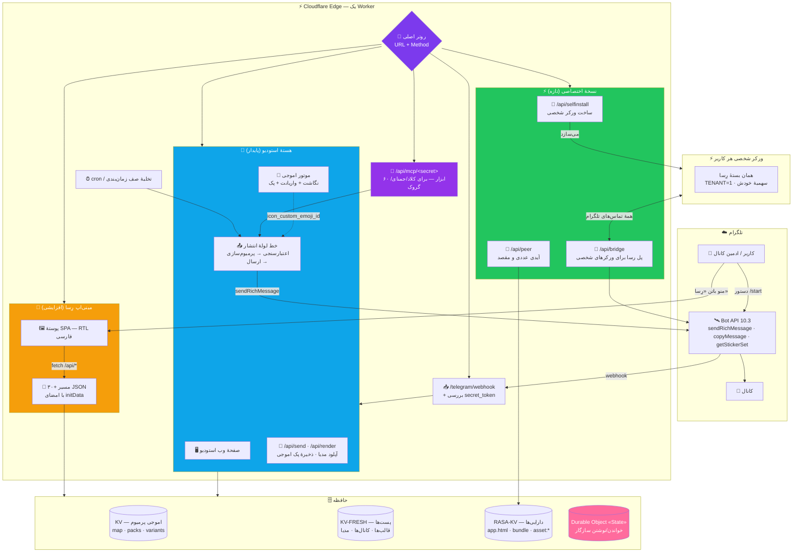
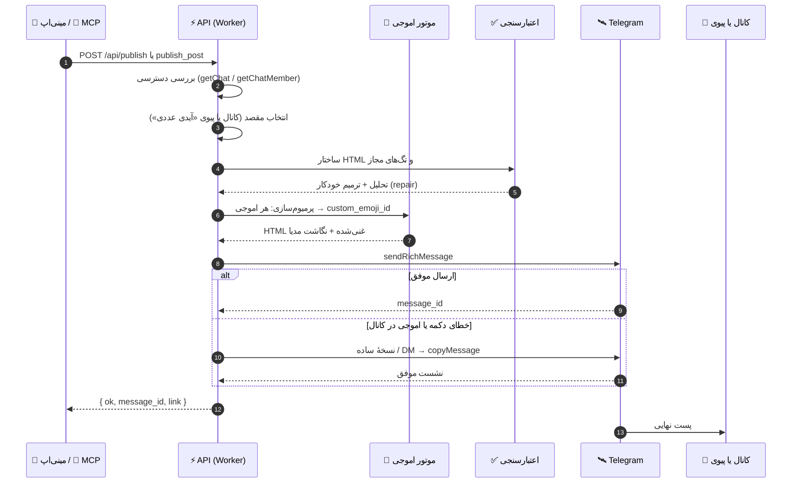
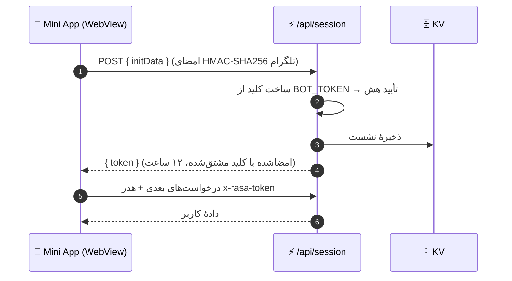
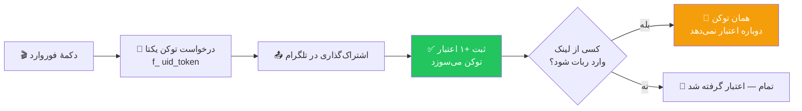

<div align="center">


<br/>


# رِسا — Rasa Studio

### استودیوی ساخت، طراحی و انتشار پست‌های ژورنالی تلگرام
**+ عامل همه‌کاره (۶۰ ابزار MCP) · لینک شخصی برای هر کاربر · مینی‌اپ فارسی**

> تازه‌ها: [لینک شخصی و نسخهٔ اختصاصی](#-لینک-شخصی--نسخهی-اختصاصی-mcp) · [اتصال به جمنای و کلاد](docs/mcp-connect.md) · [راهنمای گام‌به‌گام](docs/)

**Telegram Rich Post Studio · Premium Emoji Engine · Personal MCP Link · Mini App · on Cloudflare Workers**

<a href="https://t.me/RasaRichBot">
  
</a>
<a href="https://rich-post-bot.4lisarani-1.workers.dev/app">
  
</a>
<a href="https://github.com/Alisarani7021/RasaRichBot">
  
</a>
<a href="./LICENSE">
  
</a>

<br/>


<br/><br/>


<br/>

<a href="#-رِسا-چیست"></a>
<a href="#-english-overview"></a>
<a href="#-معماری--architecture"></a>
<a href="#-نقشهی-مسیرها--routing-map"></a>

</div>

---

<div dir="rtl">

## 📖 فهرست مطالب

- [رِسا چیست؟](#-رِسا-چیست)
- [قابلیت‌ها](#-قابلیتها--یک-نگاه)
- [لینک شخصی و نسخهٔ اختصاصی (MCP)](#-لینک-شخصی--نسخهی-اختصاصی-mcp)
- [معماری](#-معماری--architecture)
- [نقشهٔ مسیرها](#-نقشهی-مسیرها--routing-map)
- [چرخهٔ حیات یک پست](#-چرخهی-حیات-یک-پست--publish-pipeline)
- [امنیت و احراز هویت](#-امنیت-و-جریان-احراز-هویت)
- [موتور اموجی پرمیوم](#-موتور-اموجی-پرمیوم)
- [حافظه و ذخیره‌سازی](#-چه-چیزی-کجا-ذخیره-میشود--storage-map)
- [اعتبار و دعوت](#-سیستم-اعتبار-و-دعوت)
- [معماری مینی‌اپ](#-معماری-مینیاپ)
- [تست و کیفیت](#-تست-و-کیفیت)
- [محدودیت‌ها](#-محدودیتها--limits)
- [ساختار پروژه](#-ساختار-پروژه)
- [راه‌اندازی سریع](#-راهاندازی-سریع)
- [پرسش‌های پرتکرار](#-پرسشهای-پرتکرار)
- [مشارکت و مجوز](#-مشارکت)

---

## 💎 رِسا چیست؟

**رِسا** یک استودیوی کامل برای ساختن **پست‌های ریچ تلگرام** است — همان پست‌هایی که در کانال‌ها با تیتر، جدول، نقل‌قول بازشونده، دکمه‌های شیشه‌ای، فرمول ریاضی و اموجی پرمیوم دیده می‌شوند.

کل سیستم روی **Cloudflare Workers** اجرا می‌شود: بدون سرور، بدون دیتابیس، بدون هزینهٔ نگهداری.
فقط یک ورکر، سه فضای KV و یک Durable Object.

سه رابط، یک مغز:

- 🤖 **ربات تلگرام** — ساخت پله‌پلهٔ پست با دکمه و راهنمای زنده، آپلود مدیا، ذخیرهٔ پک اموجی، انتشار در کانال.
- 📱 **مینی‌اپ وب** (`/app`) — ادیتور بلوکی تصویری، پیش‌نمایش زنده، کتابخانه، زمان‌بندی، هوش مصنوعی، برند، دعوت دوستان و بخش **نسخهٔ اختصاصی**.
- 🧠 **لینک شخصی MCP** — هر کاربر با یک توکن کلادفلر، ورکر شخصی خودش را می‌سازد و لینک MCP اختصاصی می‌گیرد تا **کلاد / جمنای / گروک** بتوانند با یک جمله پست منتشر کنند.

> **اصل معماری:** هر لایهٔ تازه **افزایشی** روی هستهٔ پایدار سوار می‌شود. مسیرهای قدیمی دست‌نخورده می‌مانند (`/`, `/api/send`, `/webhook`) و رابط‌های جدید مسیرهای خودشان را دارند (`/app`, `/assets/*`, `/api/*`, `/api/mcp/*`). هیچ‌چیز نمی‌شکند و هیچ‌چیز از نو نوشته نمی‌شود.

<div align="center">

**🔗 لینک‌های زنده**

ربات: [`t.me/RasaRichBot`](https://t.me/RasaRichBot) · مینی‌اپ: [`…workers.dev/app`](https://rich-post-bot.4lisarani-1.workers.dev/app) · مخزن: [`Alisarani7021/RasaRichBot`](https://github.com/Alisarani7021/RasaRichBot)

</div>

---

## ✨ قابلیت‌ها — یک نگاه

### 🧱 ادیتور بلوکی

- **۱۵ نوع بلوک** در پالت: متن، عنوان، تصویر، جدول، فرمول، کارت محصول، جدول قیمت، تایمر آفری، نظرسنجی، نقل‌قول، بخش بازشونده، فهرست، دکمه، گروه دکمه و جداکننده.
- جابه‌جایی بلوک‌ها، ویرایش درجا و حالت **HTML خام**.
- پالت دستور (`Ctrl/⌘ + K`) + undo/redo نامحدود در یک نشست.
- تبدیل خودکار Markdown یا HTML یا متن قاطی → بلوک‌های ساخت‌یافته.

### 👁 پیش‌نمایش زنده

- رندر لحظه‌ای در شبیه‌ساز موبایل و دسکتاپ.
- رنگ‌بندی واقعی تلگرام، حالت روشن و تاریک.
- صفحه‌کلید دکمه‌ها و آشکارسازی متن ریچ.
- خروجی سورس (HTML / Markdown) با یک کلیک.

### 🍉 موتور اموجی پرمیوم

- **۱٬۶۰۰+ نگاشت اموجی** و **۲۵ پک** آماده.
- جایگزینی هوشمند با درنظرگرفتن هر دو حالت `⚡` و `⚡️`.
- نردبان امن کانال: پیام موقت در DM → `copyMessage` → انتشار (قانون Bot API 9.4).
- ذخیرهٔ پک جدید فقط با فوروارد یک استیکر به ربات.

### 🔘 دکمه‌های ریچ

- دکمهٔ شیشه‌ای داخل متن: `url` · `callback_data` · `copy_text` · `switch_inline_query` · `web_app` · `disabled`.
- استایل‌ها: `primary` · `success` · `danger` · `link` + آیکن اموجی پرمیوم.
- چیدمان راست/وسط/چپ و پشتیبانی کامل از کیبورد اینلاین کلاسیک.

### 🖼 کتابخانهٔ رسانه

- آپلود مستقیم از گالری گوشی، داخل مینی‌اپ.
- فشرده‌سازی هوشمند عکس‌های سنگین (بالای ۸MB) قبل از ارسال.
- استفادهٔ مجدد از `file_id` — بدون آپلود دوباره.
- درج در پست، حذف و مدیریت ویدیو/صدا/گیف.

### 🗂 پیش‌نویس، قالب و آرشیو

- پیش‌نویس با **تگ**، **پوشه** و **ستاره** + جستجوی متن/تگ/عنوان.
- **۶ قالب آماده**: خوش‌آمد، پروموشن، آموزشی، گزارش، دکمه‌دار و مدیایی.
- ذخیرهٔ قالب شخصی و بازیابی یک‌کلیکی.

### ⏰ زمان‌بندی و انتشار

- انتخاب کانال از لیست، با بررسی خودکار دسترسی ربات.
- زمان‌بندی انتشار + حذف خودکار بعد از مدت مشخص.
- صف کار با تخلیهٔ تنبل (lazy) و ایندکس جهانی برای cron.
- انتشار با امضای «رِسا» یا بدون امضا (با اعتبار).

### ✨ استودیوی هوش مصنوعی

- **۸ پرووایدر** آماده: Cloudflare Workers AI، Gemini، Groq، OpenRouter، Cerebras، Mistral، GitHub Models و هر سرویس سازگار با OpenAI.
- کلید هر کاربر فقط در فضای خودش ذخیره می‌شود.
- سبک‌های تولید: ویروسی، رسمی، محصولی، استاندارد.
- انتخاب خودکار «مدل نویسنده» — مدل‌های دسته‌بندی و صوتی هرگز انتخاب نمی‌شوند.

### 🎨 کیت برند

- رنگ، فوتر و استایل دکمه برای هر کانال.
- چند کیت همزمان + پیش‌نمایش زنده.

### 🎁 دعوت، اعتبار و اتصال کانال

- لینک دعوت و لینک فوروارد با توکن یک‌بارمصرف و ضدمجدد.
- اتصال کانال با بررسی ادمین‌بودن ربات و راهنمای دقیق خطاها.

### 🗳 پست زندهٔ تعاملی

- نظرسنجی با نمودار زنده، تغییر رأی و مهلت.
- قالب‌های تعاملی: کوییز، رأی‌گیری و اسلایدشو ۲–۸ عکسی.

### 🧩 پست جمعی، لندینگ و پست سه‌حالته

- **پست جمعی**: مخاطب خودش در پست مشارکت می‌کند.
- **صفحهٔ فرود داخل تلگرام** (`/p/<id>`) و **استریمر** (عددی که سرور جلو می‌برد).
- **پست سه‌حالته**: یک پیام، سه عمق؛ کاربر با دکمه سطح را عوض می‌کند.

### 📸 رندر واقعی، کاروسل زنده و پست خودتکمیل

- رندر واقعی پست و استوری برای پیش‌نمایش دقیق.
- **کاروسل زنده**: عکس درجای خودش عوض می‌شود، با ناوبری و اتوپلی.
- **پست خودتکمیل**: پوشش لحظه‌به‌لحظهٔ رخدادها.

---

## 🔗 لینک شخصی و نسخهٔ اختصاصی (MCP)

قلب تازهٔ رِسا: **هر کاربر، هوش مصنوعی خودش.**

در مینی‌اپ → بخش **⚡ نسخهٔ اختصاصی**:

1. با یک **توکن کلادفلر** (فقط یک‌بار ساخته می‌شود) یک **ورکر شخصی روی حساب خودت** ساخته می‌شود —
   با سه انبار KV، یک Durable Object، هوش مصنوعی و زمان‌بند. توکن هیچ‌جا ذخیره نمی‌شود.
2. **لینک شخصی‌ات ساخته و ذخیره می‌شود** — همیشه در همان کارت «🔗 لینک شخصی من» می‌ماند و هر وقت خواستی کپی می‌کنی.
3. لینک را در **کلاد** (Settings → Connectors) یا **جمنای** (Connected Apps) یا **گروک** (Connectors) به‌عنوان MCP اضافه می‌کنی.

بعد از آن، هر جمله‌ای که به هوش مصنوعی‌ات بگویی، با **ربات رِسا** منتشر می‌شود — و مهم‌تر: **آیدی عددی صاحب لینک خودکار ذخیره می‌شود**، پس خروجی اول به **پیوی خودش** می‌آید و فقط خودش می‌بیند؛ با یک ضربه در مینی‌اپ، مقصد به **کانال** برمی‌گردد.

```
┌──────────────────────────────┐        ┌──────────────────────────────┐
│  🤖 ربات رِسا (میزبان)        │        │  🧠 کلاد / جمنای / گروک       │
│  یک ربات برای همه            │        │  از لینک شخصی استفاده می‌کند  │
└──────────────┬───────────────┘        └──────────────┬───────────────┘
               │  پل رسا (Bridge)                      │ MCP (JSON-RPC)
               │  sendPhoto · sendRichMessage          │
┌──────────────▼───────────────┐        ┌──────────────▼───────────────┐
│  ⚡ ورکر شخصی کاربر           │◀───────│  /api/mcp/<کلید اختصاصی>      │
│  سهمیهٔ AI خودش · KV خودش     │        │  ۶۰ ابزار                     │
└──────────────────────────────┘        └──────────────────────────────┘
```

**چرا اینطوری؟** هیچ ربات تازه‌ای ساخته نمی‌شود و توکن ربات لازم نیست؛ رِسا خودش **پل** می‌شود برای همه.
هرکس ورکر خودش را دارد (سهمیه و ابزارهای خودش) و همهٔ تماس‌های تلگرام از رِسا رد می‌شود.

### 🛠 ابزارهای MCP (۶۰ عدد)

- **انتشار:** `publish_post` · `publish_media` · `album` · `draft_post` · `replace_last` · `delete_last` · `delete_post`
- **تصویر:** `make_image` (ساخت عکس و انتشار با کپشن) · آپلود multipart از راه پل
- **کانال:** `set_channel` · `get_stats` · `pin_post` · `unpin_post` · `mute_user` · `ban_user` · `unban_user`
- **مقصد:** `set_peer` — تعیین «آیدی عددی» مقصد (پیوی خودم / شخص دیگر / برگشت به کانال)
- **محتوا:** `get_occasions` (مناسبت‌های ایرانی) · `market` (طلا/سکه/ارز/کریپتو) · `translate` · `web_fetch` · `rss_add` · `watch_add`
- **زمان:** `schedule_post` · `recurring_add` · `weekly_report`
- **ساخت و میزبان:** `make_page` · `make_app` · `site_add_file` · `github_watch` · `issue_watch`
- **تجربهٔ کاربر:** `poll` · `welcome_set` · `search_archive` · `api_*` (ابزارهای سفارشی خودت)

---

## 🏗 معماری — Architecture

سه لایه، یک ورکر. هر لایه کار خودش را می‌کند و مرزهایشان دقیق است.



---

## 🔀 نقشهٔ مسیرها — Routing Map

```
مسیر                                روش        لایه      توضیح
─────────────────────────────────────────────────────────────────────────────────────
/                                   GET        هسته      استودیوی وب (تک‌فایل)
/worker.js                          GET        هسته      سورس ورکر برای مرجع
/api/send · /api/render             POST       هسته      ساخت و ارسال پست از وب
/api/emoji/all · /api/emoji/img     GET        هسته      ایندکس پک‌ها + پروکسی تصویر با کش لبه
/telegram/webhook                   POST       هسته      آپدیت‌های تلگرام (بررسی هدر سکرت)
/bundle.js                          GET        نسخه‌شخصی  بستهٔ ورکر برای ورکرهای شخصی

/app                                GET        مینی‌اپ    پوستهٔ SPA از RASA-KV
/appnext                            GET        مینی‌اپ    نسخهٔ فالبک/آزمایشی مینی‌اپ
/assets/*                           GET        مینی‌اپ    فونت، لوگو، تصویر و صدا (کش یک‌ساله)
/api/session                        POST       مینی‌اپ    تبدیل initData به توکن نشست ۱۲ساعته
/api/context                        GET        مینی‌اپ    هیدراسیون اولیه: کانال، پیش‌نویس، قالب، مدیا
/api/publish                        POST       مینی‌اپ    انتشار در کانال با بررسی دسترسی
/api/media/*                        POST       مینی‌اپ    آپلود/حذف کتابخانهٔ رسانه
/api/draft/* · /api/template/*      POST       مینی‌اپ    ذخیره، بازیابی، تگ، پوشه، قالب
/api/brand/* · /api/schedule/*      POST       مینی‌اپ    کیت برند و صف زمان‌بندی
/api/ai/* · /api/invite/*           POST       مینی‌اپ    هوش مصنوعی، اعتبار و دعوت
/api/channel/* · /api/import/*      POST       مینی‌اپ    اتصال کانال و واردکردن لینک

/api/selfinstall                    POST       اختصاصی   ساخت ورکر شخصی + ثبت آیدی عددی خودکار
/api/peer                           POST       اختصاصی   خواندن/تغییر مقصد (پیوی خودم ↔ کانال)
/api/bridge                         POST       اختصاصی   پل رسا: اجرای متدهای تلگرام برای ورکر شخصی
/api/mcp/<secret>                   POST       عامل      دروازهٔ MCP — ۶۰ ابزار (JSON-RPC)
/go · /install                      GET→302    اختصاصی   میان‌بر به بخش نسخهٔ اختصاصی مینی‌اپ
```

---

## 🤖 چرخهٔ حیات یک پست — Publish Pipeline



**نردبان افتادن (fallback ladder)** بخش سختِ کار است: اگر کانال اجازهٔ دکمه یا اموجی پرمیوم ندهد، سیستم به‌جای شکست، مرحله‌به‌مرحله سبک‌تر می‌شود تا پست برسد:

```text
sendRichMessage(کامل) → sendRichMessage(بدون آیکن دکمه) → نسخهٔ ساده → DM + copyMessage
```

و برای **عکس** هم همین منطق برقرار است: اگر عکس در `file_id` موجود باشد، پست ریچ با `tg://photo` می‌رود؛ اگر عکس فقط به‌صورت `b64` در حافظه باشد، با **multipart** به‌صورت `sendPhoto` + کپشن HTML منتشر می‌شود؛ و اگر عکسی نبود، متن تنها منتشر می‌شود و یک هشدار در پاسخ ابزار می‌آید.

---

## 🔐 امنیت و جریان احراز هویت



- **امضای `initData`** با HMAC-SHA256 و کلید مشتق‌شده از توکن ربات بررسی می‌شود؛ `auth_date` کهنه رد می‌شود.
- **نشست ۱۲ساعته** با کلید جداگانه امضا می‌شود؛ هدر `x-rasa-token`.
- **وبهوک** با `secret_token` بررسی می‌شود (سرصفحهٔ `X-Telegram-Bot-Api-Secret-Token`).
- **کلیدهای AI هر کاربر** فقط در فضای خودشان ذخیره می‌شود و هیچ‌گاه به سرور واسط نمی‌رود.
- **پل رسا** فقط متدهای مجاز تلگرام را اجرا می‌کند و هر کلید پل فقط برای همان کاربر معتبر است.

---

## 🧠 موتور اموجی پرمیوم

قلب زیبایی «رِسا» اینجاست: هر اموجیِ داخل متن، قبل از ارسال به یک **اموجی پرمیوم تلگرام** نگاشت می‌شود.

```text
┌──────────────┐     فوروارد استیکر     ┌──────────────┐
│   کاربر      │ ─────────────────────▶ │   ربات       │
└──────────────┘                        └──────┬───────┘
                                               │ getStickerSet
                                               ▼
                                    ┌─────────────────────┐
                                    │  harvest(entities)   │
                                    │  اموجی → id          │
                                    └──────┬──────────────┘
                                           │  merge
                     ┌─────────────────────┴─────────────────────┐
                     ▼                                           ▼
          ┌───────────────────┐                     ┌────────────────────┐
          │  map              │                     │  variants_map      │
          │  ✍️ → 53…27313    │                     │  ✍️ → [id1, id2…]  │
          └─────────┬─────────┘                     └──────────┬─────────┘
                    └───────────────┬───────────────────────────┘
                                    ▼
                        ┌───────────────────────┐
                        │  premiumize(html)     │
                        │  <tg-emoji id="…">    │
                        └───────────────────────┘
```

**آمار نسخهٔ زنده:**

- نگاشت‌های اموجی: **۱٬۶۰۰+** ردیف
- پک‌های شناسایی‌شده: **۲۵** پک
- کدهای کوتاه سمت مینی‌اپ: **۴۹۳** ورودی + **۲۴۶** واریانت
- پوشش دو حالت: `⚡` و `⚡️` جداگانه نگاشت می‌شوند
- بافر لبه: `/api/emoji/img` با `immutable, max-age=31536000`

---

## 📦 چه چیزی کجا ذخیره می‌شود؟ — Storage Map

```
کلید                                   شکل      محل        مصرف
──────────────────────────────────────────────────────────────────────────────────
map · packs · pkl                      JSON      KV         دیتابیس اموجی پرمیوم
emoji:map · emoji:variants_map         JSON      RASA-KV    ایندکس انتخاب‌گر اموجی مینی‌اپ
post:<id>                              JSON      KV-FRESH   بدنهٔ پست‌های در حال ویرایش
st:<uid>                               JSON      هر دو      وضعیت مکالمهٔ کاربر در ربات
d:<uid>:<id> + d:<uid>:index           JSON      KV-FRESH   پیش‌نویس‌ها و ایندکس
t:<uid>:<id>                           JSON      KV-FRESH   قالب‌های شخصی
m:<uid>                                JSON      KV-FRESH   کتابخانهٔ رسانه (file_idها)
appc:<uid>                             JSON      KV         کانال‌های وصل‌شده
brand:<uid>                            JSON      KV         کیت‌های برند
sched:<uid> + sched_global             JSON      KV         صف زمان‌بندی
ai_cfg:<uid>                           JSON      KV         کلید و مدل هوش مصنوعی
invites:<uid> · ref:<uid> · fwd:<uid>  JSON      KV         اعتبار، دعوت و توکن فوروارد
cmd:chan:<uid> · cmd:peer:<uid>        JSON      KV         مقصد پست: کانال و «آیدی عددی»
cmd:mywork:<uid>                       JSON      KV         لینک شخصی ذخیره‌شدهٔ هر کاربر
bridge:<key>                           JSON      KV         کلید پل رسا برای ورکرهای شخصی
asset:*                                binary    RASA-KV    app.html · bundle · فونت · لوگو
```

> الگوی نام‌گذاری عمداً ساده و قابل‌حدس است: `<نوع>:<شناسه>`. همین باعث می‌شود دیباگ روی نسخه‌های KV سریع باشد و مهاجرت داده ساده بماند.

---

## 🎁 سیستم اعتبار و دعوت

سه راه برای گرفتن اعتبار وجود دارد و همه‌شان ضدتکرار طراحی شده‌اند:

- 🔗 **لینک دعوت** (`start=ref_<uid>`) → **+۲ برای تو، +۲ برای او** — کاربر واقعی، یک‌بار برای هر نفر.
- 📤 **فوروارد لینک** (`start=f_<uid>_<token>`) → **+۱ همان لحظه** — همین که بفرستی؛ لازم نیست کسی وارد شود.
- ✍️ **ماندن امضای «رِسا» روی پست** → **+۱ هر ۵ پست** — دکمهٔ امضا حفظ شود.



اگر تعداد اعتبار کافی باشد، می‌توانی پست را **بدون امضا** منتشر کنی: هر پست بدون امضا یک اعتبار مصرف می‌کند.

---

## 📱 معماری مینی‌اپ

مینی‌اپ یک **تک‌فایل HTML** است (بدون باندلر، بدون فریم‌ورک) که از KV سرو می‌شود:

```
miniapp/app.html
├── 🎨 استایل        متغیرهای CSS + تم تاریک/روشن + فونت وزیرمتن
├── 🧭 پوسته         هدر، ناوبری، نماها (view) — بدون رفرش صفحه
├── 🧱 ادیتور        پالت بلوک، درگ، ویرایش درجا، حالت HTML خام
├── 👁 پیش‌نمایش     شبیه‌ساز موبایل/دسکتاپ با رندر واقعی
├── 📚 کتابخانه      پیش‌نویس، قالب، رسانه، آرشیو جستجوپذیر
├── ⚡ نسخهٔ اختصاصی  توکن کلادفلر → ورکر شخصی → لینک شخصی + آیدی عددی
├── 🖼 مدیا          آپلود، فشرده‌سازی، تخمین حجم، استفادهٔ مجدد
├── ⏰ زمان‌بندی      صف کار، تکرار، حذف خودکار
└── 🧠 هوش مصنوعی    انتخاب پرووایدر، تست اتصال، تولید متن
```

**چرا تک‌فایل؟** چون از KV سرو می‌شود، بدون build و بدون CDN اضافه، یک `PUT` هم می‌تواند کل رابط را به‌روز کند — و همان لحظه روی گوشی همه است.

---

## 🧪 تست و کیفیت

```bash
# هسته و ورکر
cd worker
npm test                          # 🧪 هر سه مجموعهٔ ورکر
node test-integration.mjs         # مسیرهای هسته، مینی‌اپ، انتشار، اموجی، اعتبار، AI
node test-manual-flow.mjs         # طراحی دستی: پایداری کلیدها بعد از افزودن عکس و ویدیو
node test-channel-connect.mjs     # اتصال کانال: ادمین‌بودن، نبودن، خطاهای API، انتخاب از فهرست
node test-emoji-packs.mjs         # اموجی: ادغام کلیدها، افزودن/حذف پک، پیش‌نمایش
node test-live-post.mjs           # پست زنده: رأی، تغییر رأی، نمودار، مهلت، سقف ظرفیت
node test-carousel.mjs            # کاروسل: ناوبری، اتوپلی، توقف، نسخهٔ دکمه‌ریچ
node test-live-tick.mjs           # تیک‌های زمان‌بندی‌شده: پیشروی، جریان زنده، ورودی تازه
node test-wave2.mjs               # موج ۲: لندینگ، گالری، کامیونیتی، پست بسته
node test-interactive-api.mjs     # قالب‌های تعاملی: ساخت/فهرست/رأی واقعی/پایان/حذف

# مینی‌اپ
cd ../miniapp
npm i jsdom && node test-channels.js   # بخش «اتصالات کانال»
node test-emoji.js                     # انتخاب‌گر اموجی
node test-interactive.js               # «قالب‌های تعاملی»
```

مجموعهٔ تست‌ها این قراردادها را تضمین می‌کند:

- ✅ مسیرهای هسته (`/`، `/api/send`، `/webhook`) پایدار می‌مانند
- ✅ پوستهٔ مینی‌اپ و دارایی‌هایش از KV سرو می‌شوند و نشست با `initData` نامعتبر رد می‌شود
- ✅ انتشار پرمیوم در کانال مسیر DM → `copyMessage` را می‌رود
- ✅ متن خراب قبل از رسیدن به تلگرام ترمیم یا حذف می‌شود
- ✅ اموجی کتابخانه در پیش‌نمایش به `tg-emoji` تبدیل می‌شود (و بلوک کد دست‌نخورده می‌ماند)
- ✅ هر توکن فوروارد فقط یک بار اعتبار می‌دهد
- ✅ مدل‌های دسته‌بندی/صوتی هرگز به‌عنوان «مدل نویسنده» انتخاب نمی‌شوند
- ✅ در «طراحی دستی»، بعد از افزودن عکس/ویدیو همهٔ کلیدها کار می‌کنند
- ✅ در اتصال کانال، شناسهٔ ربات از `getMe` خوانده می‌شود (نه عدد ثابت)
- ✅ **نسخهٔ اختصاصی:** آیدی عددی خودکار ثبت می‌شود، پست از لینک شخصی به پیوی صاحب لینک می‌رود، و مقصد با یک سوییچ به کانال برمی‌گردد
- ✅ **عکس:** انتشار با `file_id` یا multipart یا عکس هوش مصنوعی، در هر سه حالت می‌رسد

---

## ⚙️ محدودیت‌ها — Limits

- **متن پست ریچ:** ۳۲٬۷۶۸ کاراکتر (Bot API)
- **کپشن مدیا:** ۱٬۰۲۴ کاراکتر (Bot API)
- **عکس:** ۱۰MB — با فشرده‌سازی خودکار بالای ۸MB
- **ویدیو / صدا / گیف:** ۵۰MB
- **دستهٔ کپشن:** ۱۰۲۴ کاراکتر × ۱۰
- **پیش‌نویس:** ۲۰ در هر حساب · **قالب شخصی:** ۳۰ · **برند:** ۲۰ · **صف زمان‌بندی:** ۵۰ کار
- **اعتبار از فوروارد:** ۲۰ در روز + فاصلهٔ ۱۰ ثانیه (ضدسوءاستفاده)

---

## 📁 ساختار پروژه

```
RasaRichBot/
├── 📄 README.md                  همین فایل
├── 🖼️ banner.png · logo.png       دارایی‌های برند
├── 📜 LICENSE                    MIT
│
├── ⚡ worker/
│   ├── index.js                  بستهٔ نهایی ورکر (همان چیزی که دیپلوی می‌شود)
│   ├── deploy_metadata.json      بایندینگ‌های KV، Durable Object و متغیرها
│   ├── package.json
│   └── src/
│       ├── glue.js               🚦 روتر افزایشی
│       ├── config.js             ⚙️ خواندن env و پرووایدرهای AI
│       ├── store.js              🗄 لایهٔ حافظه (KV + ایندکس‌ها)
│       ├── telegram.js           🛰️ کلاینت Bot API
│       ├── miniapp.js            🔐 مسیرهای JSON با احراز هویت
│       ├── emoji/index.js        🍉 برداشت، نگاشت و پرمیوم‌سازی
│       ├── rich/
│       │   ├── kit.js            🧱 ساخت بلوک‌های ریچ
│       │   ├── validate.js       ✅ تحلیل، ترمیم و پاک‌سازی
│       │   └── send.js           📤 خط لولهٔ انتشار
│       └── flows/library.js      📚 قالب‌های آماده
│
├── 📱 miniapp/
│   ├── app.html                  پوستهٔ کامل استودیو (تک‌فایل)
│   └── assets/                   دارایی‌های سرو‌شده از KV
│
├── 🧩 patch/
│   ├── patch_b48.mjs             «رسا پل است» — نصب اختصاصی بدون ربات تازه
│   ├── rebuild.sh                زنجیرهٔ ساخت + تست
│   └── superpowers*.js           قطعه‌های موتور (۶۰ ابزار MCP)
│
├── 🧪 tests/                     تست‌های ورکر و مینی‌اپ
├── 🛠 tools/                      ابزارهای ای‌تو‌ای و پیش‌نمایش
└── 📚 docs/
    ├── ARCHITECTURE.md           معماری کامل
    ├── MINIAPP.md                آناتومی مینی‌اپ
    ├── CREDITS.md                سیستم اعتبار و دعوت
    ├── EMOJI_ENGINE.md           موتور اموجی پرمیوم
    ├── RICH_BUTTONS.md           دکمه‌های ریچ
    ├── self-install.md           نسخهٔ اختصاصی و لینک شخصی
    ├── mcp-connect.md            اتصال به جمنای/کلاد/گروک
    └── DEPLOYMENT.md             استقرار، سکرت‌ها و برگرداندن نسخه
```

---

## ⚡ راه‌اندازی سریع

### ۱️⃣ دریافت کد

```bash
git clone https://github.com/Alisarani7021/RasaRichBot.git
cd RasaRichBot
```

### ۲️⃣ ساخت ربات

در [@BotFather](https://t.me/BotFather): `/newbot` → نام و یوزرنیم دلخواه → توکن را نگه دار.

```text
/setdescription  🌟 رِسا — استودیوی ساخت پست‌های ژورنالی تلگرام
/setabouttext    Rich posts · Premium emoji · Mini App · on Cloudflare
/setcommands     start - شروع · app - مینی‌اپ · post - استودیو · guide - راهنما
```

و در **Bot Settings → Menu Button** آدرس مینی‌اپ را بگذار: `https://<worker-domain>/app`

### ۳️⃣ سکرت‌ها

```bash
cp .dev.vars.example .dev.vars
# مقادیر را فقط داخل .dev.vars بگذار — این فایل در .gitignore است
```

### ۴️⃣ دیپلوی

```bash
cd worker
npx wrangler deploy
```

### ۵️⃣ ثبت وبهوک

```bash
curl "https://api.telegram.org/bot<TOKEN>/setWebhook" \
  -d "url=https://<worker-domain>/telegram/webhook" \
  -d "secret_token=<WEBHOOK_SECRET>"
```

### ۶️⃣ بررسی سلامت

```bash
curl -s https://<worker-domain>/api/health
```

راهنمای کامل: [`docs/DEPLOYMENT.md`](./docs/DEPLOYMENT.md) · معماری: [`docs/ARCHITECTURE.md`](./docs/ARCHITECTURE.md) · لینک شخصی: [`docs/self-install.md`](./docs/self-install.md)

---

## ❓ پرسش‌های پرتکرار

<details>
<summary><b>چرا Cloudflare Workers و نه یک VPS؟</b></summary>
<br/>
چون این پروژه ماهیت «همیشه روشن، کم‌ترافیک و پرتعداد ریکوئست کوچک» دارد. ورکر در لبه اجرا می‌شود، پلن رایگانش برای یک ربات پرمصرف کافی است و هیچ سروری برای پچ‌زدن امنیتی نداری.
</details>

<details>
<summary><b>داده‌ها کجا ذخیره می‌شوند؟ کسی به آن‌ها دسترسی دارد؟</b></summary>
<br/>
همه‌چیز در فضای KV و Durable Object خودت است؛ کلیدهای API کاربران هم فقط در فضای خودشان ذخیره می‌شود. هیچ درخواستی به سرور واسط فرستاده نمی‌شود.
</details>

<details>
<summary><b>لینک شخصی چه فرقی با ربات اصلی دارد؟</b></summary>
<br/>
ربات همان «رِسا» است و توکن ربات تازه‌ای ساخته نمی‌شود. لینک شخصی فقط ورکر مخصوص خودت را به هوش مصنوعی‌ات وصل می‌کند تا با <b>سهمیهٔ خودت</b> کار کند و خروجی، اول به <b>پیوی خودت</b> بیاید.
</details>

<details>
<summary><b>اموجی پرمیوم در کانال کار نمی‌کند — مشکل چیست؟</b></summary>
<br/>
قانون Bot API 9.4: کانال‌ها اموجی پرمیوم را فقط از راه کپی از یک DM می‌پذیرند. ربات این را خودکار انجام می‌دهد؛ فقط کافی است یک‌بار به ربات <code>/start</code> داده باشی تا DM باز شود.
</details>

<details>
<summary><b>اگر پست با دکمه ارسال نشد چه می‌شود؟</b></summary>
<br/>
نردبان fallback خودکار عمل می‌کند: نسخهٔ بدون آیکن دکمه، بعد نسخهٔ ساده، بعد DM + کپی. پست همیشه منتشر می‌شود.
</details>

<details>
<summary><b>عکس چطور منتشر می‌شود؟</b></summary>
<br/>
اگر <code>file_id</code> موجود باشد، پست ریچ با <code>tg://photo</code> می‌رود؛ اگر عکس فقط در حافظه باشد، با <code>sendPhoto</code> و کپشن HTML منتشر می‌شود؛ اگر عکسی نباشد، متن تنها می‌رود و هشدار می‌گیری.
</details>

<details>
<summary><b>چطور مدل هوش مصنوعی را عوض کنم؟</b></summary>
<br/>
در تب «هوش مصنوعی» کلید و آدرس سرویس سازگار با OpenAI را وارد کن و «تست اتصال» را بزن. سرور لیست مدل‌ها را می‌خواند، مدل‌های غیرنویسنده را رد می‌کند و مناسب‌ترین را انتخاب و ذخیره می‌کند.
</details>

<details>
<summary><b>می‌توانم بدون امضای «رِسا» منتشر کنم؟</b></summary>
<br/>
بله. یا ۵ پست با امضا منتشر کن تا یک اعتبار بگیری، یا از دوستانت دعوت کن. هر پست بدون امضا یک اعتبار مصرف می‌کند.
</details>

</div>

---

<div align="center">

## 🌍 English Overview

</div>

**Rasa** is a production-grade **Telegram Rich Post Studio** that runs entirely on **Cloudflare Workers** — no servers, no databases, no build step.

It ships three interfaces on a single worker:

- 🤖 **Bot interface** — a step-by-step post builder in Telegram with live previews, media upload, premium-emoji harvesting and channel publishing.
- 📱 **Mini App** (`/app`) — a Persian-first SPA with a block editor, live preview, media library, drafts, scheduling, brand kits, AI studio and a referral/credits system.
- 🧠 **Personal MCP link** — each user spins up their own worker on their own Cloudflare account and connects Claude / Gemini / Grok to it. Every Telegram call is bridged through the main Rasa bot, so **no new bots are needed**.

### Highlights

- 🍉 **Emoji engine** — harvests `custom_emoji` entities from forwarded stickers, keeps base + VS16 variants, and rewrites plain emoji into `<tg-emoji>` before publishing.
- 🔘 **Rich buttons** — full support for Bot API 9.4+ inline button styles and 10.3 rich-button rows, with a 4-step degradation ladder so a post always lands.
- 🖼 **Photo publishing** — rich posts with `tg://photo`, multipart `sendPhoto` fallback, and AI-generated images as a last resort.
- 🪪 **Numeric-ID routing** — each personal link stores its owner's numeric Telegram ID, so AI output goes to **their own private chat** first, switchable to the channel from the mini app.
- 🔐 **Auth** — Telegram `initData` verified with HMAC-SHA256, exchanged for a 12-hour session token signed with a derived key.
- 🗄 **Storage** — three KV namespaces for different lifecycles plus a Durable Object for consistent state reads, with a flat, predictable key scheme.
- ⏰ **Scheduling** — per-user job queues with a global index, drained lazily and by cron — no external scheduler service.
- ✨ **AI studio** — bring-your-own-key across 8 OpenAI-compatible providers, with server-side model hygiene so text classifiers can never be selected as writers.
- 🎁 **Credits** — single-use forward tokens give +1 credit the moment a link is shared, while staying duplicate-proof and rate limited.

### Quick start

```bash
git clone https://github.com/Alisarani7021/RasaRichBot.git && cd RasaRichBot
cp .dev.vars.example .dev.vars      # fill in BOT_TOKEN + WEBHOOK_SECRET
cd worker && npx wrangler deploy
```

Full deployment guide: [`docs/DEPLOYMENT.md`](./docs/DEPLOYMENT.md) · Architecture: [`docs/ARCHITECTURE.md`](./docs/ARCHITECTURE.md) · MCP: [`docs/mcp-connect.md`](./docs/mcp-connect.md)

---

<div dir="rtl">

## 🛣 نقشهٔ راه

- [x] استودیوی پست + موتور اموجی پرمیوم + دکمه‌های ریچ
- [x] مینی‌اپ تصویری با احراز هویت تلگرام
- [x] کتابخانهٔ رسانه با آپلود مستقیم و فشرده‌سازی
- [x] زمان‌بندی، کیت برند، واردکردن لینک
- [x] استودیوی هوش مصنوعی چندپرووایدری
- [x] سیستم اعتبار، دعوت و فوروارد
- [x] دروازهٔ MCP و اتصال به کلاد / جمنای / گروک
- [x] نسخهٔ اختصاصی: ورکر شخصی + لینک همیشه‌در‌دسترس + آیدی عددی خودکار
- [x] انتشار عکس (multipart + پل رسا) و مقصد پیوی
- [ ] گزارش آمار هفتگی خودکار روی کانال
- [ ] آمار بازدید پست‌ها و A/B تست تیتر
- [ ] حالت تیمی: چند ادمین روی یک کانال با نقش‌های جدا
- [ ] خروجی PDF/تصویر از پیش‌نمایش پست

---

## 🤝 مشارکت

هر ایده، گزارش باگ یا پول‌ریکوئست خوش‌آمد است:

1. یک برنچ تازه بساز: `git checkout -b feature/نام-قابلیت`
2. تغییر را با یک پیام کامیت گویا ثبت کن
3. پول‌ریکوئست بزن و رفتار قبل/بعد را توضیح بده

راهنمای کامل مشارکت: [`CONTRIBUTING.md`](./CONTRIBUTING.md) · سیاست امنیتی: [`SECURITY.md`](./SECURITY.md) · آیین‌نامهٔ رفتار: [`CODE_OF_CONDUCT.md`](./CODE_OF_CONDUCT.md) · تاریخچهٔ تغییرات: [`CHANGELOG.md`](./CHANGELOG.md)

### ✅ تست‌ها

هر تغییری باید با تست بیاید؛ کل مجموعه بدون هیچ وابستگی بیرونی اجرا می‌شود:

```bash
npm test        # مجموعه‌های تست روی ورکر — با ماسک تلگرام و KV جعلی
```

---

## 📄 مجوز

این پروژه زیر مجوز **MIT** منتشر شده است — می‌توانی آزادانه استفاده، تغییر و توزیع کنی. متن کامل: [`LICENSE`](./LICENSE)

</div>

<div align="center">

<br/>

**ساخته‌شده برای کانال‌هایی که محتوا را جدی می‌گیرند**

ساختهٔ [@Alisarani7021](https://github.com/Alisarani7021) · [ربات](https://t.me/RasaRichBot) · [مینی‌اپ](https://rich-post-bot.4lisarani-1.workers.dev/app)


</div>
