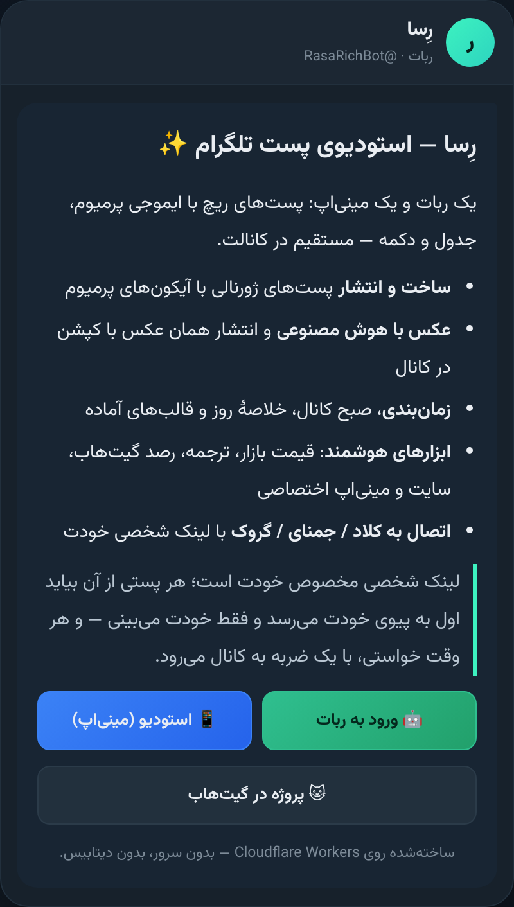
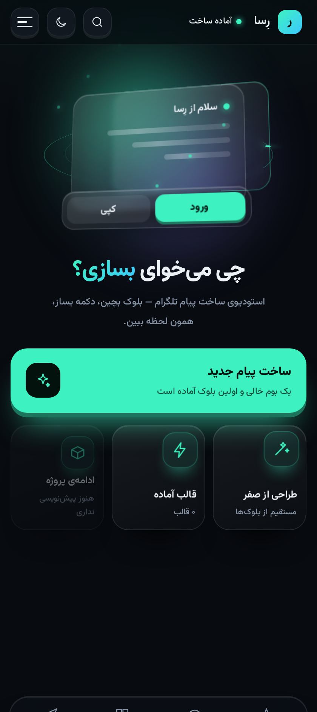
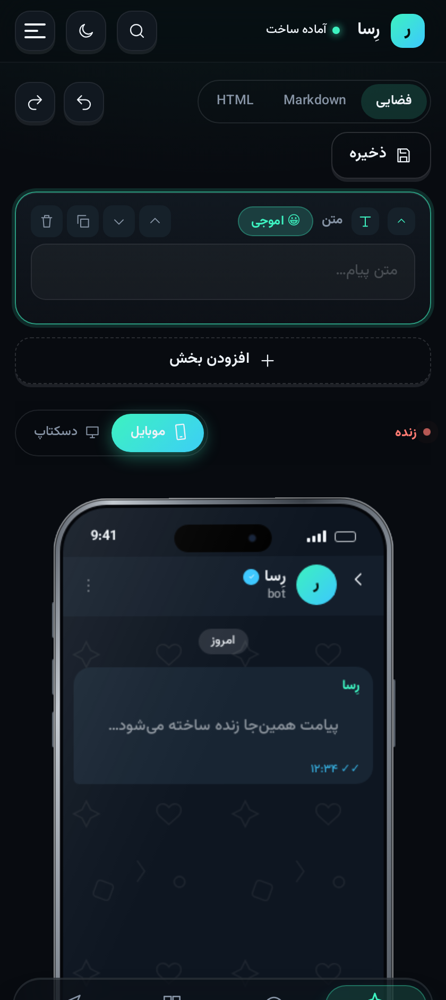
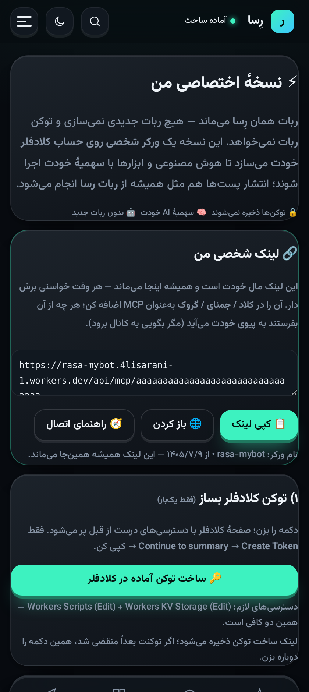
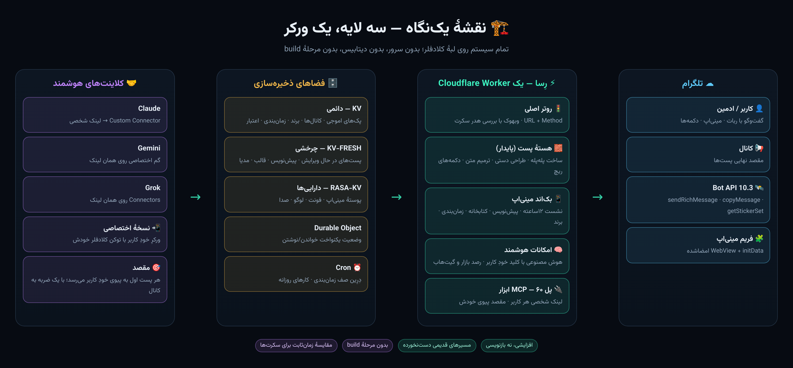
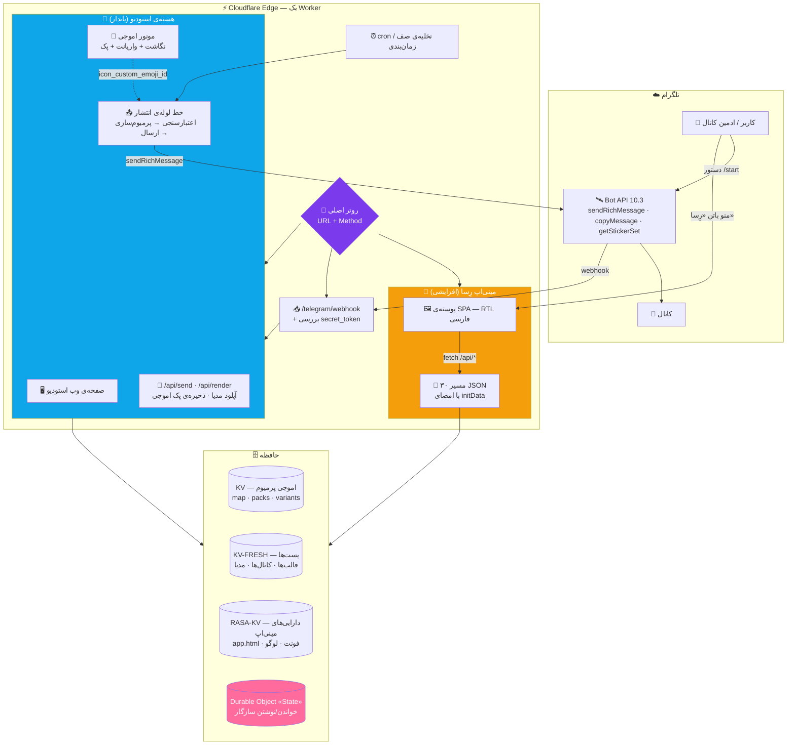
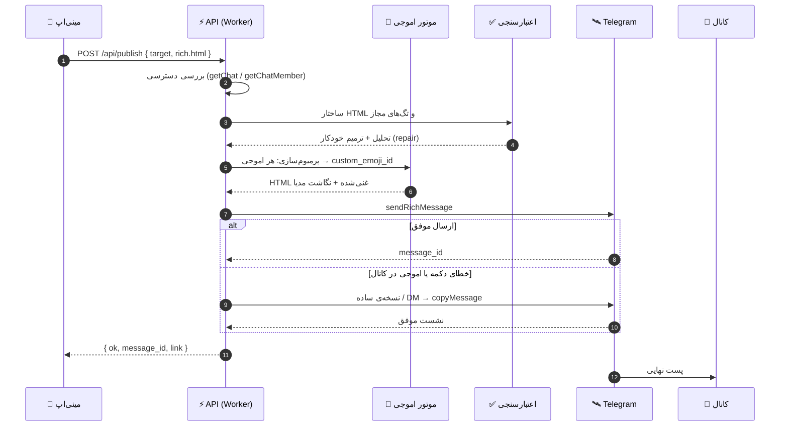
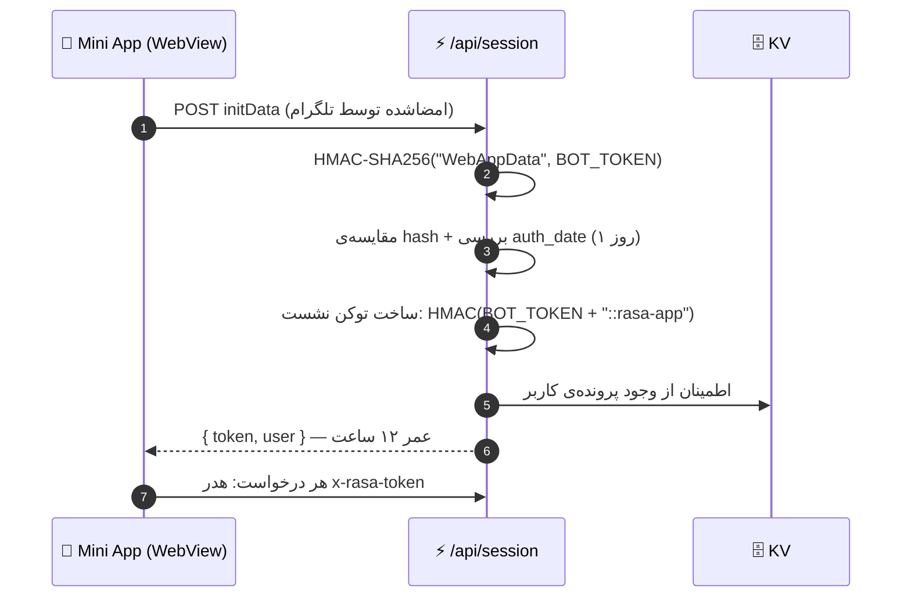
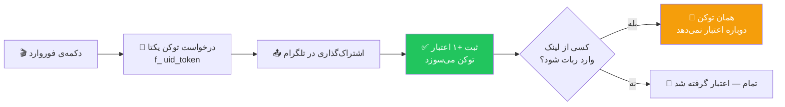
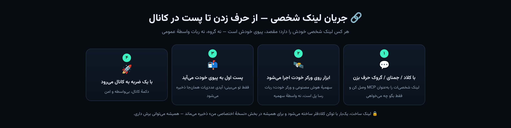

<div align="center">


<br/>


# رِسا — Rasa Studio

### استودیوی ساخت، طراحی و انتشار پست‌های ژورنالی تلگرام
**+ عامل همه‌کاره (۶۰ ابزار MCP): رصد گیت‌هاب، میزبانی HTML، اپ هوشمند، کدنویسی، ابزارهای سفارشی**

> تازه‌ها: [نسخهٔ اختصاصی روی ورکر خودت](docs/self-install.md) · [لینک شخصی و پل MCP](docs/mcp-connect.md) · [قدرت‌های نامحدود](docs/agent-unlimited.md) · [برگهٔ راهنمای فارسی b51](docs/b51-cheat-sheet.md) · [تاریخ تغییرات](CHANGELOG.md)
**Telegram Rich Post Studio · Premium Emoji Engine · Mini App · on Cloudflare Workers**

<a href="https://t.me/RasaRichBot">
  
</a>
<a href="https://rich-post-bot.4lisarani-1.workers.dev/app">
  
</a>
<a href="./LICENSE">
  
</a>

<br/>


<br/><br/>


<br/>

[](#-رِسا-چیست) · [](#-english-overview) · [](#-معماری--architecture)

<a href="#-قابلیتها--یک-نگاه"></a>
<a href="#-موتور-اموجی-پرمیوم"></a>
<a href="#-معماری-مینیاپ"></a>
<a href="#-نسخهٔ-اختصاصی-و-لینک-شخصی--your-own-worker-your-own-link"></a>
<a href="#-تست-و-کیفیت"></a>
<a href="#-راهاندازی-سریع"></a>
<a href="#-پرسشهای-پرتکرار"></a>

</div>

---

<div dir="rtl">

## 💎 رِسا چیست؟

**رِسا** یک استودیوی کامل برای ساختن **پست‌های ریچ تلگرام** است — همان پست‌هایی که در کانال‌ها با تیتر، جدول، نقل‌قول بازشونده، دکمه‌های شیشه‌ای، فرمول ریاضی و اموجی پرمیوم دیده می‌شوند.

کل سیستم روی **Cloudflare Workers** اجرا می‌شود: بدون سرور، بدون دیتابیس، بدون هزینه‌ی نگهداری. فقط یک ورکر، سه فضای KV و یک Durable Object.

<div align="center">


<sub>🎨 یک ورکر، دو رابط، بی‌نهایت پست — همه روی لبهٔ کلادفلر</sub>

</div>

دو رابط کاربری کاملاً مستقل روی یک ورکر سوار شده‌اند:

🤖 **ربات تلگرام** — [`@RasaRichBot`](https://t.me/RasaRichBot) · ساخت پله‌پله‌ی پست با دکمه و راهنمای زنده، آپلود مدیا، ذخیره‌ی پک اموجی، انتشار در کانال.

📱 **مینی‌اپ وب** — [`/app`](https://rich-post-bot.4lisarani-1.workers.dev/app) · ادیتور بلوکی تصویری، پیش‌نمایش زنده، کتابخانه، زمان‌بندی، هوش مصنوعی، برند، دعوت دوستان.

> اصل معماری: لایه‌ی جدید **افزایشی** روی هسته‌ی پایدار سوار می‌شود. مسیرهای قدیمی دست‌نخورده می‌مانند (`/`, `/api/send`, `/webhook`) و رابط مینی‌اپ از مسیرهای خودش (`/app`, `/assets/*`, `/api/*`) سرو می‌شود. هیچ‌چیز نمی‌شکند، هیچ‌چیز دوباره نوشته نمی‌شود.

<div align="center">

**🔗 لینک‌های زنده**

ربات: [`t.me/RasaRichBot`](https://t.me/RasaRichBot) · مینی‌اپ: [`…workers.dev/app`](https://rich-post-bot.4lisarani-1.workers.dev/app)

</div>

---

## ✨ قابلیت‌ها — یک نگاه

</div>


<div align="center">


</div>

### 🧱 ادیتور بلوکی
- **۱۵ نوع بلوک** در پالت: متن، عنوان، تصویر، جدول، فرمول، کارت محصول، جدول قیمت، تایمر آفری، نظرسنجی، نقل‌قول، بخش بازشونده، فهرست، دکمه، گروه دکمه، جداکننده
- جابه‌جایی بلوک‌ها، ویرایش درجا، حالت **HTML خام**
- پالت دستور (`Ctrl/⌘ + K`) + undo/redo
- تبدیل خودکار Markdown یا HTML یا متن قاطی → بلوک‌های ساخت‌یافته

### 👁 پیش‌نمایش زنده
- رندر همان لحظه در شبیه‌ساز موبایل/دسکتاپ
- رنگ‌بندی واقعی تلگرام، حالت روشن و تاریک
- استفاده از صفحه‌کلید دکمه‌ها و آشکارسازی متن ریچ
- خروجی گرفتن سورس (HTML/Markdown) با یک کلیک

### 🍉 موتور اموجی پرمیوم
- **۱٬۶۰۰+ نگاشت اموجی** و **۲۵ پک** آماده
- جایگزینی هوشمند با درنظرگرفتن هر دو حالت `⚡` و `⚡️`
- نردبان امن برای کانال: پیام موقت در DM → `copyMessage` → انتشار (قانون Bot API 9.4)
- ذخیره‌ی پک جدید فقط با فوروارد یک استیکر به ربات

### 🔘 دکمه‌های ریچ
- دکمه‌ی شیشه‌ای داخل متن: `url` · `callback_data` · `copy_text` · `switch_inline_query` · `web_app` · `disabled`
- استایل‌ها: `primary` · `success` · `danger` · `link`
- سازنده‌ی دکمه با چیدمان راست/وسط/چپ و آیکن اموجی پرمیوم
- کیبورد اینلاین کلاسیک هم پشتیبانی می‌شود

### 🖼 کتابخانه‌ی رسانه
- آپلود از گالری گوشی، مستقیم از داخل مینی‌اپ
- فشرده‌سازی هوشمند عکس‌های سنگین (> ۸MB) قبل از ارسال
- استفاده‌ی مجدد از `file_id` — آپلود دوباره لازم نیست
- درج در پست، حذف، و مدیریت ویدیو/صدا/گیف

### 🗂 پیش‌نویس، قالب و آرشیو
- پیش‌نویس با **تگ**، **پوشه** و **ستاره**
- جستجو در عنوان/تگ/محتوای هر پیش‌نویس
- **۶ قالب آماده**: خوش‌آمد، پروموشن، آموزشی، گزارش، دکمه‌دار، مدیایی
- ذخیره‌ی قالب شخصی و بازیابی یک‌کلیکی

### ⏰ زمان‌بندی و انتشار
- انتخاب کانال از لیست (با بررسی خودکار دسترسی ربات)
- زمان‌بندی انتشار + حذف خودکار بعد از مدت مشخص
- صف کارها با تخلیه‌ی تنبل (lazy) و ایندکس جهانی برای cron
- انتشار با امضای «رِسا» یا بدون امضا (اعتبار)

### ✨ استودیوی هوش مصنوعی
- **۸ پرووایدر** آماده: Cloudflare Workers AI، Gemini، Groq، OpenRouter، Cerebras، Mistral، GitHub Models و هر سرویس سازگار با OpenAI
- کلید هر کاربر فقط در فضای خودش ذخیره می‌شود
- سبک‌های تولید: ویروسی، رسمی، محصولی، استاندارد
- انتخاب خودکار «مدل نویسنده» (مدل‌های دسته‌بندی و صوتی رد می‌شوند)

### 🎨 کیت برند
- رنگ، فوتر و استایل دکمه برای هر کانال
- اعمال یک‌کلیکی روی کل پست
- تا ۲۰ برند ذخیره‌شده در هر حساب

### 🎁 دعوت، اعتبار و اتصال کانال
- **لینک دعوت**: هر نفری که وارد شود → `+۲` برای تو و `+۲` برای خودش
- **لینک فوروارد**: هر فوروارد → `+۱` همان لحظه (بدون نیاز به ورود کسی)
- توکن یک‌بارمصرف ضدتکرار + سقف روزانه + فاصله‌ی زمانی
- اتصال کانال با فوروارد یک پست یا زدن `@username`

### 🗳 پست زندهٔ تعاملی
- یک پیام که با رأی مخاطب‌ها **برای همه** به‌روز می‌شود: نمودار میله‌ای، درصد، تعداد
- رأی قابل تغییر است، رأی تکراری شمرده نمی‌شود، مهلت با `tg-time` سرِ خودِ پست می‌شمره
- رأی‌دهنده‌ها اعضای عادی کانال‌اند (نه اپراتور ربات) — مسیر callback پیش از هر دروازه‌ای پردازش می‌شود
- وضعیت هر نظرسنجی در `live:<id>` و رندر یکتا در `worker/live_render.js` (همان فایل، هم در باندل هم در فرستندهٔ پیام)

### 🧩 پست جمعی (مخاطب خودش پست را می‌سازد)
- پست با یک دکمه شروع می‌شود؛ هر عضو **یک خط** اضافه می‌کند و **همان پیام** بالا می‌رود (فقط سازنده می‌تواند ببندد)
- خط هر عضو با نام و زمانش ثبت می‌شود، تکراری‌ها حذف می‌شوند، سقف ۶۰ خط و نوار پیشرفت `████░░`
- وضعیت در `comm:<id>`؛ دکمه‌های «خطم را اضافه کن» / «تازه‌سازی» / «کاملش کن»

### 🏬 صفحهٔ فرود داخل تلگرام (`/p/<id>`)
- از خودِ پست ساخته می‌شود: هیرو، متن، جدول، گالری، دکمهٔ تماس و **فرم ثبت‌نام**
- بدون سایت و ابزار بیرونی؛ داخل WebView تلگرام و به‌صورت لینک وب کار می‌کند (CSS درون‌خطی، ضد ایندکس)
- ثبت فرم با `POST /api/landing/submit` ذخیره می‌شود و **همان لحظه** در پیوی صاحب کانال می‌رسد؛ `GET /api/landing/count?page=` شمارنده می‌دهد
- محتوا در `land:<id>` (KV عمومی) و ثبت‌ها در `landsubs:<id>`

### 📚 پست سه‌حالته (یک پیام، سه عمق)
- خلاصهٔ ۳۰ ثانیه / نسخهٔ متوسط / نسخهٔ کامل — همه در **همان پیام**؛ تپ روی دکمه‌ها محتوا را بازنویسی می‌کند
- وضعیت در `deep:<id>`؛ دکمهٔ حالت فعال با ● علامت می‌گیرد

### 🌊 استریمر (عددی که سرور جلو می‌برد)
- یک مقدار زنده (شمارنده، قیمت، ظرفیت) که کرون هر دقیقه با گام و نوسان تنظیم‌شده جلو می‌برد
- کنارش **نمودار کوچک** (`▁▂▄▆█`) از ۲۴ نقطهٔ آخر + زمان «الان»؛ شیب/سقف/کف از `full.flow` می‌آید

### 📸 رندر واقعی پست و استوری
- استودیو از متن پست، قاب **۱۰۸۰×۱۳۵۰** (اینستاگرام) و **۱۰۸۰×۱۹۲۰** (استوری) با تایپوگرافی فارسی می‌سازد (`tools/make-assets.py`)
- کلاژ چهار عکسی (آلبوم) و **اسلایدشوی نیتیو** (`tg-slideshow`) و **گالری چندتبی** (تب‌های متنی داخل یک پیام)

### 🎠 کاروسل زنده (عکس درجای خودش عوض می‌شود)
- یک پیام، چند عکس: با هر تپ، **همان پیام** عوض می‌شود و عکس بعدی جای قبلی می‌نشیند (بدون پیام جدید)
- دکمه‌های ◀️ / ▶️ / شماره‌ی اسلایدها، شمارنده‌ی فارسی («۲ / ۴») و نقطه‌های مسیر
- **پخش خودکار**: کرون هر دقیقه یک اسلاید جلو می‌رود؛ با ⏸ می‌شود نگهش داشت و با ▶️ دوباره روشنش کرد
- وضعیت در `car:<id>` و رندر یکتا در `worker/carousel_render.js`

### 🛰 پست خودتکمیل (پوشش لحظه‌به‌لحظه)
- پست با یک خط شروع می‌شود و از آن به بعد **خودِ سرور** خط‌های تازه را به همان پیام اضافه می‌کند — بدون پیام جدید
- هر خط با `tg-time` زمان‌دار است؛ عنوان/وضعیت پست هم با هر به‌روزرسانی می‌تواند عوض شود
- کارهای زمان‌بندی‌شده با `kind: "live_tick"` در همان `scheduled()` اجرا می‌شوند (پست‌های زمان‌بندی‌شدهٔ قبلی دست‌نخورده‌اند)

### 🎨 اموجی پرمیوم (یک رجیستری واحد)
- **همه‌ی پک‌ها در مینی‌اپ دیده می‌شوند** — فهرست از یک رجیستری واحد می‌آید، نه از یک کلید قدیمی
- **مدیریت پک‌ها داخل خودِ مینی‌اپ**: افزودن با لینک `t.me/addemoji/…`، حذف پک، شمارنده‌ی «چند اموجی در چند پک»
- جست‌وجو روی تمام پک‌ها + تفکیک پک‌های هم‌نام + پیش‌نمایش زنده هم همان رجیستری را می‌بیند
- فهرست استیکر هر پک در کلید خودش ذخیره می‌شود تا رجیستری چند کیلوبایتی بماند
- پاسخ‌های اموجی `no-store` هستند و درخواست‌ها با نوسازی زمانی می‌روند؛ WebView تلگرام دیگر فهرست کهنه نشان نمی‌دهد
- با هر بار باز شدن شیت، فهرست در پس‌زمینه بی‌صدا تازه می‌شود

### 📡 اتصالات کانال (بخش اختصاصی مینی‌اپ)
- **اتصال بدون فوروارد:** دکمه‌ی «📲 باز کردن انتخاب کانال در تلگرام» در مینی‌اپ → چت ربات → دکمه‌ی `request_chat` → انتخاب کانال از فهرست خود تلگرام
- با برگشتن به مینی‌اپ، فهرست خودکار تازه می‌شود (بدون رفرش دستی)؛ لینک مستقیم بخش: `/app?v=31#conn`
- لیست کانال‌های وصل‌شده با وضعیت زنده‌ی دسترسی
- **بررسی دوباره** برای هر کانال، **انتخاب به‌عنوان مقصد انتشار** و **قطع اتصال**
- افزودن کانال با `@username` یا شناسه‌ی `-100…`
- تشخیص دقیق خطا: «ربات ادمین نیست»، «ربات ادمین است ولی اجازه‌ی ارسال پیام ندارد»، «تو ادمین نیستی»
- راهنمای گام‌به‌گام ادمین‌کردن ربات، همان‌جا در همان صفحه
- **ثبت خودکار:** به‌محض اینکه ربات را در کانالی ادمین کنی، کانال خودش در فهرست اتصالات می‌نشیند و همان لحظه در چت به تو اطلاع داده می‌شود (و با حذف ربات، از فهرست پاک می‌شود)


<div dir="rtl">

---

<div dir="rtl">

## 📸 نگاهی به محصول

چهار نمای واقعی از رِسا — همان چیزی که کاربر می‌بیند.

</div>

<table>
<tr>
<td align="center" width="170" valign="top"><br/><sub>🤖 پست ریچ — در ربات</sub></td>
<td align="center" width="170" valign="top"><br/><sub>📱 خانهٔ استودیو</sub></td>
</tr>
<tr>
<td align="center" width="170" valign="top"><br/><sub>🧱 ادیتور + پیش‌نمایش زنده</sub></td>
<td align="center" width="170" valign="top"><br/><sub>📲 «نسخهٔ اختصاصی من»</sub></td>
</tr>
</table>

---

## 🏗 معماری — Architecture

سه لایه، یک ورکر. هر لایه کار خودش را می‌کند و مرزهایشان دقیق است.

<div align="center">



<sub>💡 نسخه‌ی تصویری همین نقشه — برای وقتی که وقت خواندن نداری. جزئیات کامل، پایین‌تر.</sub>

</div>



<div align="center">

### 🔀 نقشه‌ی مسیرها — Routing Map

</div>

**🚏 نقشه‌ی مسیرها — ۳۰ مسیر روی یک ورکر**

**🧱 هسته — کلاسیک و پایدار (دست‌نخورده)**

- `GET /` — صفحه‌ی وب استودیو (نسخه‌ی تک‌فایلی)
- `GET /worker.js` — سورس ورکر برای مرجع
- `POST /api/send` · `POST /api/render` — ساخت و ارسال پست از وب
- `GET /api/emoji/all` · `GET /api/emoji/img` — ایندکس پک‌ها + پروکسی تصویر اموجی با کش لبه
- `POST /telegram/webhook` — دریافت آپدیت‌های تلگرام (بررسی هدر سکرت)

**📱 مینی‌اپ — پوسته و دارایی‌ها**

- `GET /app` — پوسته‌ی SPA از `RASA_KV`
- `GET /assets/*` — فونت، لوگو، تصویر و صدای برند با کش یک‌ساله
- `POST /api/session` — تبدیل `initData` به توکن نشست ۱۲ساعته
- `GET /api/context` — هیدراسیون اولیه: کانال، پیش‌نویس، قالب، مدیا

**🚀 محتوا و انتشار**

- `POST /api/publish` — انتشار در کانال با بررسی دسترسی
- `POST /api/media/*` — آپلود/حذف کتابخانه‌ی رسانه
- `POST /api/draft/*` · `POST /api/template/*` — ذخیره، بازیابی، تگ، پوشه، قالب
- `POST /api/brand/*` — کیت برند
- `POST /api/schedule/*` — ساخت و مدیریت صف زمان‌بندی
- `POST /api/channel/*` · `POST /api/import/*` — اتصال کانال و وارد کردن لینک

**🤝 تعامل، هوش و رشد**

- `POST /api/interactive/*` — نظرسنجی، چندحالته، اسلایدشو، پایان، حذف
- `POST /api/ai/*` — تنظیم، تست و تولید با هوش مصنوعی
- `POST /api/invite/*` — اعتبار، لینک دعوت و لینک فوروارد
- `GET/POST /api/peer` · `POST /api/mcp/<token>` — لینک شخصی و پل MCP (۶۰ ابزار)

---

## 🤖 چرخه‌ی حیات یک پست — Publish Pipeline

</div>



<div dir="rtl">

نکته‌ی مهم: **نردبان افتادن (fallback ladder)** بخش سختِ کار است. اگر کانال اجازه‌ی دکمه یا اموجی پرمیوم ندهد، سیستم به‌جای شکست، مرحله‌به‌مرحله سبک‌تر می‌شود تا پست برسد:

`sendRichMessage(کامل)` → `sendRichMessage(بدون آیکن دکمه)` → `نسخه‌ی ساده` → `DM + copyMessage`

---

## 🔐 امنیت و جریان احراز هویت



</div>

**🛡 لایه‌های دفاعی**

- **📥 وبهوک** — هدر `X-Telegram-Bot-Api-Secret-Token` با مقایسه‌ی زمان‌ثابت
- **🔐 نشست مینی‌اپ** — `initData` + HMAC-SHA256 روی `WebAppData`، سپس توکن ۱۲ساعته با کلید مشتق‌شده
- **👮 دسترسی ادمین** — `ADMIN_KEY` (Bearer) و لیست سفید `ADMINS_ID`
- **🧼 اعتبارسنجی متن** — تگ‌های مجاز، تحلیل ساختار، ترمیم خودکار قبل از ارسال
- **🕵️ سوءاستفاده از اعتبار** — توکن یک‌بارمصرف، سقف روزانه، فاصله‌ی زمانی، محافظت از خود-دعوت
- **🔑 کلید هوش مصنوعی** — فقط در فضای همان کاربر و صرفاً برای همان کاربر
- **🔌 پل MCP** — کلید اختصاصی پل؛ خطای کلید، داده‌ی کاربر را برنمی‌گرداند و مقصد پیش‌فرض فقط با دستور صریح خودِ کاربر عوض می‌شود

> ⚠️ **هیچ‌وقت توکن واقعی را در ریپو نگذارید.** تمام نمونه‌ها در این مستندات جای‌نگهدار هستند. اگر توکنی لو رفت، همان لحظه در BotFather با `/revoke` باطل کنید و سکرت‌های Worker را تازه کنید.

---

<div dir="rtl">

## 🧠 موتور اموجی پرمیوم

قلب زیبایی «رِسا» اینجاست: هر اموجیِ داخل متن، قبل از ارسال به یک **اموجی پرمیوم تلگرام** نگاشت می‌شود.

<br/>

**جریان داده:**

```
┌──────────────┐     فوروارد استیکر     ┌──────────────┐
│   کاربر      │ ─────────────────────▶ │   ربات       │
└──────────────┘                        └──────┬───────┘
                                               │ getStickerSet
                                               ▼
                                    ┌─────────────────────┐
                                    │  harvest(entities)   │
                                    │  اموجی → id          │
                                    └──────┬──────────────┘
                                           │  merge
                     ┌─────────────────────┴─────────────────────┐
                     ▼                                           ▼
          ┌───────────────────┐                     ┌────────────────────┐
          │  map              │                     │  variants_map      │
          │  ✍️ → 53…27313   │                     │  ✍️ → [id1, id2…] │
          └─────────┬─────────┘                     └──────────┬─────────┘
                    └───────────────┬───────────────────────────┘
                                    ▼
                        ┌───────────────────────┐
                        │  premiumize(html)     │
                        │  <tg-emoji id="…">    │
                        └───────────────────────┘
```

<br/>

<table width="100%">
<tr>
<td align="center" width="25%"><h3>۱٬۶۰۰+</h3><sub>🗺 نگاشت اموجی</sub></td>
<td align="center" width="25%"><h3>۲۵</h3><sub>📦 پک شناسایی‌شده</sub></td>
<td align="center" width="25%"><h3>۴۹۳</h3><sub>⌨️ کد کوتاه مینی‌اپ</sub></td>
<td align="center" width="25%"><h3>۲۴۶</h3><sub>🎛 واریانت</sub></td>
</tr>
</table>

- **🎭 پوشش دو حالت** — `⚡` و `⚡️` جداگانه نگاشت می‌شوند؛ هیچ اموجی‌ای قربانی نمی‌شود
- **⚡ بافر لبه** — `/api/emoji/img` با `immutable, max-age=31536000`؛ تصویر یک‌بار از تلگرام، بعد از لبه
- **🧵 پایداری یکسان** — نگاشت اصلی و واریانت‌ها در دو کلید جدا (`emoji:map` · `emoji:variants_map`) تا انتخاب‌گر مینی‌اپ هرگز سردرگم نشود

---

## 📦 چه چیزی کجا ذخیره می‌شود؟ — Storage Map

</div>

**🗄 چه چیزی کجا می‌نشیند**

**📚 دائمی — `KV`**

- `map` · `packs` · `pkl` — دیتابیس اموجی پرمیوم
- `emoji:map` · `emoji:variants_map` — ایندکس مینی‌اپ برای انتخاب‌گر اموجی
- `appc:<uid>` — کانال‌های وصل‌شده
- `brand:<uid>` — کیت‌های برند
- `sched:<uid>` + `sched_global` — صف زمان‌بندی
- `ai_cfg:<uid>` — کلید و مدل هوش مصنوعی هر کاربر
- `invites:<uid>` — اعتبار، دعوت‌ها، توکن‌های فوروارد
- `ref:<uid>` · `fwd:<uid>` — اثرانگشت یک‌بارمصرف دعوت/فوروارد
- `cmd:*` — تنظیم‌های شخصی هر کاربر: کانال مقصد، پل، **لینک شخصی ماندگار**، آخرین پست

**♻️ چرخشی — `KV-FRESH`**

- `post:<id>` — بدنه‌ی پست‌های در حال ویرایش
- `d:<uid>:<id>` + `d:<uid>:index` — پیش‌نویس‌ها و ایندکس‌شان
- `t:<uid>:<id>` — قالب‌های شخصی
- `m:<uid>` — کتابخانه‌ی رسانه (`file_id`ها)

**🎨 دارایی‌ها و حالت زنده**

- `st:<uid>` — وضعیت مکالمه‌ی کاربر در ربات *(در هر دو فضا)*
- `asset:*` — `app.html`، فونت‌ها، لوگو، تصویر و صدای برند *(در `RASA-KV`)*

> الگوی نام‌گذاری عمداً ساده و قابل‌حدس است: `<نوع>:<شناسه>`. همین باعث می‌شود دیباگ روی نسخه‌های KV سریع باشد و مهاجرت داده ساده بماند.

---

<div dir="rtl">

## 🎁 سیستم اعتبار و دعوت

سه راه برای گرفتن اعتبار وجود دارد و همه‌شان ضدتکرار طراحی شده‌اند:

</div>

**🎁 سه راه کسب اعتبار**

- 🔗 **دعوت** — هر کس با لینک تو (`start=ref_<uid>`) وارد شود: **+۲ برای تو، +۲ برای او** *(کاربر واقعی، یک‌بار برای هر نفر)*
- 📤 **فوروارد لینک** — با `start=f_<uid>_<token>` همان لحظه **+۱** *(همین که بفرستی؛ لازم نیست کسی وارد شود)*
- ✍️ **ماندن امضای «رِسا»** — روی پست، **+۱ هر ۵ پست** *(دکمه‌ی امضا حفظ شود)*



<div dir="rtl">

و اگر تعداد اعتبار کافی باشد، می‌توانی پست را **بدون امضا** منتشر کنی: هر پست بدون امضا یک اعتبار مصرف می‌کند.

**تبدیل اعتبار به قدرت:** از تب «دوستان» می‌توانی اعتبار بگیری، از تب «انتشار» می‌توانی بی‌امضا بفرستی.

---

## 📱 معماری مینی‌اپ

مینی‌اپ یک **تک‌فایل HTML** است (بدون باندلر، بدون فریم‌ورک) که از KV سرو می‌شود:

</div>

```
miniapp/app.html
├── 🎨 استایل        متغیرهای CSS + تم تاریک/روشن + فونت وزیرمتن
├── 🧩 مدل بلاک      { id, type, … }  ← منبع حقیقت ادیتور
├── 🔁 سه مسیر تبدیل  بلاک ⇄ HTML ⇄ Markdown
├── 👁 رندرر پیش‌نمایش  شبیه‌ساز موبایل/دسکتاپ + دکمه‌ها
├── 🍉 انتخابگر اموجی  از ایندکس سرور + لود تدریجی
├── 🖼 خط لوله‌ی رسانه  فشرده‌سازی در مرورگر → FormData → file_id
├── ✨ پنل هوش مصنوعی  کلید، تست، انتخاب مدل، تولید
├── 🎁 پنل دوستان      لینک دعوت + لینک فوروارد + شمارنده
└── 🔌 لایه‌ی API       fetch + هدر x-rasa-token + مدیریت خطای فارسی
```

<div dir="rtl">

**اصول طراحی که رعایت شده:**

- **حالت نمایشی (demo) بدون سرور:** اگر اپ بیرون تلگرام باز شود، همه‌ی رابط کار می‌کند و فقط نوشتن روی سرور غیرفعال می‌شود.
- **پیام خطای انسانی:** هر خطای شبکه، حجم فایل، سقف تلگرام یا خطای پرووایدر به یک جمله‌ی فارسی قابل‌فهم تبدیل می‌شود.
- **بازخورد لمسی:** `HapticFeedback` روی اکشن‌های مهم.
- **کش‌شکنی هوشمند:** `app.html` با `no-store` سرو می‌شود تا آپدیت‌ها فوری بنشینند.

---

## 🧩 قالب‌های تعاملی در مینی‌اپ

سه قالبی که قبلاً فقط به‌صورت دمو ساخته می‌شدند، حالا فرمِ آماده در مینی‌اپ دارند: مقصد را انتخاب می‌کنی، پر می‌کنی، منتشر می‌شود، و از همان صفحه مدیریت می‌شود.

</div>

```
miniapp → «🧩 قالب‌های تعاملی»  (منوی همبرگری)
├── 📚 پست چندحالته   خلاصهٔ لازم + متوسط اختیاری + کامل لازم → سه دکمه در همان پیام (deep:<id>:short|mid|full)
├── 🎞 اسلایدشو نیتیو  ۲–۸ عکس (آپلود با /api/media/upload) → <tg-slideshow> با مدیای ریچ
├── 🗳 نظرسنجی زنده    سؤال + ۲–۶ گزینه + مهلت اختیاری → دکمه‌های اینلاین رأی (vote:<id>:oN)
└── 📋 منتشرشده‌های من   پایان رأی‌گیری / حذف / لینک پست
```

<div dir="rtl">

**قرارداد API (همه با نشست مینی‌اپ، `x-rasa-token`):**

**قرارداد قالب‌های تعاملی** — همه با نشست مینی‌اپ (`x-rasa-token`):

- `POST /api/interactive/list` — ۳۰ مورد آخر + شمارنده‌ی رأی زنده‌ی هر نظرسنجی
- `POST /api/interactive/poll` — ورودی `{target,title,subtitle,options[2..6],minutes}` → خروجی `{ok,id,kind,message_id,link}`
- `POST /api/interactive/levels` — ورودی `{target,title,levels{short,mid,full}}` → همان خروجی
- `POST /api/interactive/slideshow` — ورودی `{target,caption,media[{fileId}×(2..8)]}` → همان خروجی
- `POST /api/interactive/end` — ورودی `{id}` → مهلت بسته و پیام با نتیجه‌ی نهایی ویرایش می‌شود
- `POST /api/interactive/remove` — ورودی `{id,kind}` → پیام حذف و وضعیت پاک می‌شود

- **مقصد:** `me` (پیوی خودت) یا `@channel`؛ برای کانال، همان `channelCheck` بخش اتصالات اجرا می‌شود و اگر ربات/کاربر ادمین نباشد، خطای فارسی روشن برمی‌گردد.
- **فرمت متن:** هر سه قالب HTML یا مارک‌داون می‌پذیرند؛ تشخیص با `HTML_TAG_RE` انجام می‌شود (همان مسیر `mixedToHtml`/`mdToHtml`).
- **رأی‌ها:** با دکمه‌های اینلاین روی همان پیام؛ رأی قابل تغییر است و نمودار درجا به‌روز می‌شود (بدون ارسال پیام تازه).
- **کش‌شکنی:** آدرس مینی‌اپ در کیبورد ربات `?v=33` است تا نسخه‌ی تازه فوری بنشیند.

**ویرایش‌های ریچ، ریچ می‌مانند.** پست‌های ریچ فقط در لحظه‌ی ارسال «ریچ» نبودند؛ هر ویرایش از مسیر پاک‌سازِ پیام‌های کلاسیک می‌گذشت و جدول به خط ساده، تیتر به متن بولد و `<code>`ها به متن خام تبدیل می‌شد. الان:

- `editPostMessage(..., { rich: true })` محتوای ریچ را دست‌نخورده به `rich_message` می‌دهد؛ پاک‌ساز فقط رده‌ی بعدی (fallback) است.
- خطای «message is not modified» موفقیت حساب می‌شود تا یک تازه‌سازی بی‌اثر، پیام سالم را خراب نکند.
- این مسیر برای هر سه قالب تعاملی، کاروسل (نسخه‌ی دکمه‌ریچ) و تب متنی استودیو فعال است.
- اموجی‌های پرمیوم از همان **پیام اول** تبدیل می‌شوند (`applyEmojiSubs` در مسیر ارسال هم اجرا می‌شود) و آیکن دکمه‌ها هم از اولین ارسال ست می‌شود.

**داخل مینی‌اپ:** پیش‌نمایش زنده‌ی همان متن (جدول واقعی، بخش تاشو، نقل‌قول، اموجی پرمیوم به‌صورت تصویر)، دکمه‌های `+ جدول / + بخش تاشو / + نقل‌قول / + فهرست / + تیتر / + جداکننده` و نوار اموجی سریع که تگ `<tg-emoji emoji-id="…">` را سر کرسر می‌گذارد.

---

---

<div dir="rtl">

## 📲 نسخهٔ اختصاصی و لینک شخصی — Your Own Worker, Your Own Link

هر کاربر می‌تواند رِسا را روی **حساب کلادفلر خودش** بالا بیاورد: **بدون ساختن ربات جدید، بدون توکن ربات** — با سهمیه‌ی ورکر و هوش مصنوعی خودش. ربات رسا فقط پل است.

<div align="center">



</div>

**🧭 در پنج قدم**

1. در مینی‌اپ به بخش **«نسخهٔ اختصاصی من»** برو.
2. با یک توکن کلادفلر — فقط **یک‌بار** — ورکر شخصی‌ات ساخته می‌شود: سه فضای KV، وضعیت، هوش مصنوعی و کلید پل.
3. **لینک شخصی MCP** تحویل می‌گیری: `https://<worker>/api/mcp/<token>`.
4. همین لینک را به‌عنوان MCP به **کلاد / جمنای / گروک** وصل می‌کنی (راهنمای هر سه در مینی‌اپ هست).
5. از این به بعد فقط حرف می‌زنی؛ پست اول به **پیوی خودت** می‌رسد و با یک ضربه به کانال می‌رود.

**🔐 چرا امن و راحت است**

- توکن کلادفلر **یک‌بار** مصرف می‌شود و لینک ساختش برای همیشه در `cmd:mywork:<uid>` می‌ماند — هر وقت خواستی برش داری.
- **آیدی عددی** هر کاربر همان لحظه‌ی ساخت لینک ذخیره می‌شود؛ کلاینت‌های هوشمند می‌دانند لینک مالِ کیست و مقصد کجاست — پیوی همان شخص، نه جای دیگر.
- خطای کلید پل (`403`) هرگز داده‌ی کاربر را برنمی‌گرداند و مقصد پیش‌فرض فقط با دستور صریح خودِ کاربر عوض می‌شود.

</div>

<div align="center">


<br/>

<sub>بخش «نسخهٔ اختصاصی من» در مینی‌اپ — توکن یک‌بارمصرف + لینک شخصی ماندگار</sub>

</div>

<div dir="rtl">

**🧰 ۶۰ ابزار روی لینک شخصی** — ساخت و انتشار پست · بلوک‌های ریچ · اموجی پرمیوم · کتابخانه‌ی رسانه · زمان‌بندی · قالب‌های تعاملی (نظرسنجی، چندحالته، اسلایدشو) · رصد گیت‌هاب · میزبانی HTML · ابزارهای سفارشی خودِ کاربر · آمار کانال و…

**[راهنمای نصب اختصاصی →](docs/self-install.md)** · **[اتصال به کلاد، جمنای و گروک →](docs/mcp-connect.md)** · **[برگهٔ راهنمای b51 →](docs/b51-cheat-sheet.md)**

</div>

## 🧪 تست و کیفیت

</div>

> **۲۶۱ سنجه در ۹ مجموعه‌ی تست — همه سبز ✅** این‌ها قراردادهای زنده‌اند، نه تشریفات: هر تغییر تا وقتی همه‌شان پاس نشوند منتشر نمی‌شود.

```bash
cd worker
npm test                          # 🧪 هر سه مجموعه‌ی ورکر
node test-integration.mjs         # مسیرهای هسته، مینی‌اپ، انتشار، اموجی، اعتبار، AI
node test-manual-flow.mjs         # طراحی دستی: پایداری کلیدها بعد از افزودن عکس و ویدیو
node test-channel-connect.mjs     # اتصال کانال: ادمین‌بودن، نبودن، نبود دسترسی ارسال پیام، خطای API، ثبت خودکار، انتخاب از فهرست تلگرام
node test-emoji-packs.mjs         # اموجی: ادغام کلیدها، افزودن/حذف پک، سبک ماندن رجیستری، پیش‌نمایش
node test-live-post.mjs           # پست زنده: رأی، تغییر رأی، نمودار، مهلت، سقف ظرفیت
node test-carousel.mjs            # کاروسل: ناوبری، اتوپلی، توقف، نسخهٔ دکمه‌ریچ
node test-live-tick.mjs           # تیک‌های زمان‌بندی‌شده: پیشروی، جریان زنده، ورودی تازه
node test-wave2.mjs               # موج ۲: لندینگ، گالری، کامیونیتی، پست بسته
node test-interactive-api.mjs     # قالب‌های تعاملی: ساخت/فهرست/رأی واقعی/پایان/حذف

cd ../miniapp
npm i jsdom && node test-channels.js   # بخش «اتصالات کانال»: افزودن، بررسی، انتخاب مقصد، حذف
node test-emoji.js                     # انتخاب‌گر اموجی: شمارنده، مدیریت پک‌ها، افزودن با لینک، حذف
node test-interactive.js               # «قالب‌های تعاملی»: سه فرم، آپلود اسلایدشو، خطای دسترسی کانال، فهرست
```

<div dir="rtl">

مجموعه‌ی تست‌ها این قراردادها را تضمین می‌کنند:

- ✅ مسیرهای هسته (`/`، `/api/send`، `/webhook`) بیت‌به‌بیت پایدار می‌مانند
- ✅ پوسته‌ی مینی‌اپ و دارایی‌هایش از KV سرو می‌شوند و نشست با `initData` نامعتبر رد می‌شود
- ✅ انتشار پرمیوم در کانال مسیر DM → `copyMessage` را می‌رود
- ✅ متن خراب قبل از رسیدن به تلگرام ترمیم یا حذف می‌شود
- ✅ اموجی کتابخانه در مسیر پیش‌نمایش به `tg-emoji` تبدیل می‌شود (و بلوک کد دست‌نخورده می‌ماند)
- ✅ هر توکن فوروارد فقط یک بار اعتبار می‌دهد
- ✅ مدل‌های دسته‌بندی/صوتی هرگز به‌عنوان «مدل نویسنده» انتخاب نمی‌شوند
- ✅ لینک شخصی و آیدی عددی هر کاربر ذخیره می‌شود و مقصد پیش‌فرضِ انتشار، پیوی خودش است
- ✅ توکن کلادفلر فقط یک‌بار مصرف می‌شود و لینک ساخته‌شده همیشه از مسیر خودش قابل بازیابی است
- ✅ پل MCP با کلید اختصاصی محافظت می‌شود؛ کلید نامعتبر نه ابزار می‌بیند، نه داده
- ✅ در «طراحی دستی»، بعد از افزودن عکس/ویدیو همه‌ی کلیدها کار می‌کنند (پیام مدیایی از مسیر کپشن ویرایش می‌شود)
- ✅ در اتصال کانال، شناسه‌ی ربات از `getMe` خوانده می‌شود (نه عدد ثابت) و فوروارد در هر دو شکل `forward_origin` و `forward_from_chat` شناسایی می‌شود
- ✅ بخش «اتصالات کانال» مینی‌اپ: لیست، بررسی، انتخاب مقصد، قطع اتصال و باز کردن انتخاب کانال در تلگرام
- ✅ انتخاب کانال از فهرست تلگرام (`request_chat` + `chat_shared`) با راهنمای دقیق برای هر حالت خطا
- ✅ قالب‌های تعاملی مینی‌اپ: نظرسنجی ساخته‌شده از مینی‌اپ رأی واقعی می‌گیرد، پیام چندحالته با دکمه‌ها سطح عوض می‌کند، اسلایدشو ۲–۸ عکس می‌پذیرد و «پایان رأی‌گیری»/«حذف» واقعاً روی پیام اعمال می‌شود

---

## ⚙️ محدودیت‌ها — Limits

</div>

**⚙️ سقف‌ها — از طرف تلگرام**

- **متن پست ریچ** — ۳۲٬۷۶۸ کاراکتر
- **کپشن مدیا** — ۱٬۰۲۴ کاراکتر
- **عکس** — ۱۰MB *(فشرده‌سازی خودکار بالای ۸MB)*
- **ویدیو / صدا / گیف** — ۵۰MB

**🧱 سقف‌ها — طراحی داخلی (به‌ازای هر حساب)**

- **دسته‌ی کپشن** — ۱٬۰۲۴ کاراکتر × ۱۰
- **پیش‌نویس** — ۲۰ · **قالب شخصی** — ۳۰ · **برند** — ۲۰ · **صف زمان‌بندی** — ۵۰ کار
- **اعتبار از فوروارد** — ۲۰ در روز + فاصله‌ی ۱۰ ثانیه *(ضدسوءاستفاده)*

---

<div dir="rtl">

## 📁 ساختار پروژه

</div>

```
RasaRichBot/
├── 📄 README.md                  همین فایل
├── 🖼️ banner.png · logo.png       دارایی‌های برند
├── 📜 LICENSE                    MIT
├── 🔐 .dev.vars.example          نمونه‌ی متغیرهای محیطی (بدون مقدار واقعی)
├── 📸 docs/shots/                اسکرین‌شات‌ها و نقشه‌های گرافیکی همین README
│
├── ⚡ worker/
│   ├── index.js                  بسته‌ی نهایی ورکر (همان چیزی که دیپلوی می‌شود)
│   ├── wrangler.toml             بایندینگ‌های KV و Durable Object
│   ├── package.json
│   ├── test-integration.mjs      تست‌های یکپارچگی
│   └── src/
│       ├── glue.js               🚦 روتر افزایشی مینی‌اپ
│       ├── config.js             ⚙️ خواندن env و پرووایدرهای AI
│       ├── store.js              🗄 لایه‌ی حافظه (KV + ایندکس‌ها)
│       ├── telegram.js           🛰️ کلاینت Bot API
│       ├── miniapp.js            🔐 ۳۰ مسیر JSON با احراز هویت
│       ├── emoji/index.js        🍉 برداشت، نگاشت و پرمیوم‌سازی
│       ├── rich/
│       │   ├── kit.js            🧱 ساخت بلوک‌های ریچ
│       │   ├── validate.js       ✅ تحلیل، ترمیم و پاک‌سازی
│       │   └── send.js           📤 خط لوله‌ی انتشار
│       └── flows/library.js      📚 قالب‌های آماده
│
├── 📱 miniapp/
│   ├── app.html                  پوسته‌ی کامل استودیو (تک‌فایل)
│   └── assets/                   دارایی‌های سرو‌شده از KV
│
└── 📚 docs/
    ├── ARCHITECTURE.md           معماری کامل
    ├── MINIAPP.md                آناتومی مینی‌اپ
    ├── CREDITS.md                سیستم اعتبار و دعوت
    ├── EMOJI_ENGINE.md           موتور اموجی پرمیوم
    ├── RICH_BUTTONS.md           دکمه‌های ریچ و کدهای زبان
    └── DEPLOYMENT.md             استقرار، سکرت‌ها و برگرداندن نسخه
```

---

<div dir="rtl">

## ⚡ راه‌اندازی سریع

### ۱️⃣ دریافت کد

```bash
git clone https://github.com/Alisarani7021/RasaRichBot.git
cd RasaRichBot
```

### ۲️⃣ ساخت ربات

در [@BotFather](https://t.me/BotFather): `/newbot` → نام و یوزرنیم دلخواه → توکن را نگه دار.

سپس تنظیمات ظاهر:

```
/setdescription  🌟 رِسا — استودیوی ساخت پست‌های ژورنالی تلگرام
/setabouttext    Rich posts · Premium emoji · Mini App · on Cloudflare
/setcommands     start - شروع · app - مینی‌اپ · post - استودیو · guide - راهنما
```

و در **Bot Settings → Menu Button** آدرس مینی‌اپ را بگذار: `https://<worker-domain>/app`

### ۳️⃣ سکرت‌ها

```bash
cp .dev.vars.example .dev.vars
# مقادیر را فقط داخل .dev.vars بگذارید — این فایل در .gitignore است
```

**🔑 متغیرهای محیطی**

- `BOT_TOKEN` *(سکرت)* — توکن ربات از BotFather
- `WEBHOOK_SECRET` *(سکرت)* — رشته‌ی تصادفی؛ همان `secret_token` وبهوک
- `ADMIN_KEY` *(سکرت، اختیاری)* — توکن اپراتور برای مسیرهای مدیریتی
- `ADMINS_ID` *(متن، اختیاری)* — لیست سفید شناسه‌های مدیر
- `WEBHOOK_PATH` *(متن)* — پیش‌فرض `/telegram/webhook`
- `BRIDGE_KEY` *(سکرت)* — کلید پل MCP؛ درخواست‌های لینک شخصی و کلاینت‌های هوشمند از همین محافظت می‌شوند

### ۴️⃣ دیپلوی

```bash
cd worker
npx wrangler deploy
```

یا با API چندبخشی (روشی که سکرت‌ها را دست‌نخورده نگه می‌دارد):

```bash
curl -X PUT \
  "https://api.cloudflare.com/client/v4/accounts/$ACCOUNT_ID/workers/scripts/rich-post-bot" \
  -H "Authorization: Bearer $CLOUDFLARE_API_TOKEN" \
  -F 'metadata={"main_module":"index.js","compatibility_date":"2026-09-28",
       "keep_bindings":["secret_text"],
       "bindings":[ ... همان بایندینگ‌های wrangler.toml ... ]};type=application/json' \
  -F "index.js=@worker/index.js;type=application/javascript+module"
```

> 💡 کلید `keep_bindings: ["secret_text"]` باعث می‌شود `BOT_TOKEN`، `WEBHOOK_SECRET` و `ADMIN_KEY` بعد از هر آپدیت سرجایشان بمانند — بدون آن، هر دیپلوی سکرت‌ها را پاک می‌کند.

### ۵️⃣ ثبت وبهوک

```bash
curl -X POST "https://api.telegram.org/bot$BOT_TOKEN/setWebhook" \
  -H "Content-Type: application/json" \
  -d '{"url":"https://<worker-domain>/telegram/webhook",
       "secret_token":"<WEBHOOK_SECRET>",
       "allowed_updates":["message","callback_query","my_chat_member"]}'
```

### ۶️⃣ آپلود دارایی‌های مینی‌اپ

پوسته و دارایی‌ها از KV خوانده می‌شوند؛ کافی است کلیدها را بنویسید:

```bash
curl -X PUT "$CF_API/accounts/$ACCOUNT_ID/storage/kv/namespaces/$RASA_KV/values/asset%3Aapp.html" \
  -H "Authorization: Bearer $CLOUDFLARE_API_TOKEN" \
  --data-binary @miniapp/app.html
```

### ۷️⃣ بررسی سلامت

```bash
curl -I https://<worker-domain>/            # 200 → صفحه‌ی استودیو
curl -I https://<worker-domain>/app         # 200 → مینی‌اپ
curl -X POST https://<worker-domain>/api/session   # 401 → احراز هویت فعال است ✅
```

</div>

---

## 🌍 English Overview

**Rasa** is a production-grade **Telegram Rich Post Studio** that runs entirely on **Cloudflare Workers** — no servers, no databases, no build step.

It ships two interfaces on a single worker:

- 🤖 **Bot interface** — a step-by-step post builder in Telegram with live previews, media upload, premium-emoji harvesting and channel publishing.
- 📱 **Mini App** (`/app`) — a Persian-first SPA with a block editor, live preview, media library, drafts, scheduling, brand kits, AI studio and a referral/credits system.

### Highlights

- 🍉 **Emoji engine** — Harvests `custom_emoji` entities from forwarded stickers, keeps base + VS16 variants, and rewrites plain emoji into `<tg-emoji>` before publishing.
- 🔘 **Rich buttons** — Full support for Bot API 9.4+ inline button styles and 10.3 rich-button rows, with a 4-step degradation ladder so a post always lands.
- 🔐 **Auth** — Telegram `initData` verified with HMAC-SHA256, exchanged for a 12-hour session token signed with a derived key.
- 🗄 **Storage** — Three KV namespaces for different lifecycles plus a Durable Object for consistent state reads, with a flat, predictable key scheme.
- ⏰ **Scheduling** — Per-user job queues with a global index, drained lazily and by cron — no external scheduler service.
- ✨ **AI studio** — Bring-your-own-key across 8 OpenAI-compatible providers, with server-side model hygiene so text classifiers can never be selected as writers.
- 🎁 **Credits** — Single-use forward tokens give +1 credit the moment a link is shared, while staying duplicate-proof and rate limited.
- 🔗 **Personal MCP link** — Every user installs the studio on **their own** Cloudflare account with a **one-time** token, then keeps a permanent personal MCP link whose destination is **their own DM**. Claude, Gemini and Grok drive publishing through 60 tools — the bot is just the bridge.

### Quick start

```bash
git clone https://github.com/Alisarani7021/RasaRichBot.git && cd RasaRichBot
cp .dev.vars.example .dev.vars      # fill in BOT_TOKEN + WEBHOOK_SECRET
cd worker && npx wrangler deploy
```

Full deployment guide: [`docs/DEPLOYMENT.md`](./docs/DEPLOYMENT.md) · Architecture: [`docs/ARCHITECTURE.md`](./docs/ARCHITECTURE.md)

---

<div dir="rtl">

## 🛣 نقشه‌ی راه

- [x] استودیوی پست + موتور اموجی پرمیوم + دکمه‌های ریچ
- [x] مینی‌اپ تصویری با احراز هویت تلگرام
- [x] کتابخانه‌ی رسانه با آپلود مستقیم و فشرده‌سازی
- [x] زمان‌بندی، کیت برند، وارد‌کردن لینک
- [x] استودیوی هوش مصنوعی چندپرووایدری
- [x] سیستم اعتبار، دعوت و فوروارد
- [ ] نظرسنجی و کوییز تعاملی در پست
- [ ] آمار بازدید پست‌ها و A/B تست تیتر
- [ ] حالت تیمی: چند ادمین روی یک کانال با نقش‌های جدا
- [ ] خروجی PDF/تصویر از پیش‌نمایش پست

---

## ❓ پرسش‌های پرتکرار

<details>
<summary><b>چرا Cloudflare Workers و نه یک VPS؟</b></summary>
<br/>
چون این پروژه ماهیت «همیشه روشن، کم‌ترافیک و پرتعداد ریکوئست کوچک» دارد. ورکر در لبه اجرا می‌شود، پلن رایگانش برای یک ربات پرمصرف کافی است و هیچ سروری برای پچ‌زدن امنیتی نداری.
</details>

<details>
<summary><b>داده‌ها کجا ذخیره می‌شوند؟ کسی به آن‌ها دسترسی دارد؟</b></summary>
<br/>
همه‌چیز در فضای KV و Durable Object خودت است؛ کلیدهای API کاربران هم فقط در فضای خودشان ذخیره می‌شود. هیچ درخواستی به سرور واسط فرستاده نمی‌شود.
</details>

<details>
<summary><b>اموجی پرمیوم در کانال کار نمی‌کند — مشکل چیست؟</b></summary>
<br/>
قانون Bot API 9.4: کانال‌ها اموجی پرمیوم را فقط از راه کپی از یک DM می‌پذیرند. ربات این را خودکار انجام می‌دهد؛ فقط کافی است یک‌بار به ربات `/start` داده باشی تا DM باز شود.
</details>

<details>
<summary><b>اگر پست با دکمه ارسال نشد چه می‌شود؟</b></summary>
<br/>
نردبان fallback خودکار عمل می‌کند: نسخه‌ی بدون آیکن دکمه، بعد نسخه‌ی ساده، بعد DM + کپی. پست همیشه منتشر می‌شود.
</details>

<details>
<summary><b>چطور مدل هوش مصنوعی را عوض کنم؟</b></summary>
<br/>
در تب «هوش مصنوعی» کلید و آدرس سرویس سازگار با OpenAI را وارد کن و «تست اتصال» را بزن. سرور لیست مدل‌ها را می‌خواند، مدل‌های غیرنویسنده را رد می‌کند و مناسب‌ترین را انتخاب و ذخیره می‌کند.
</details>

<details>
<summary><b>می‌توانم بدون امضای «رِسا» منتشر کنم؟</b></summary>
<br/>
بله. یا ۵ پست با امضا منتشر کن تا یک اعتبار بگیری، یا از دوستانت دعوت کن. هر پست بدون امضا یک اعتبار مصرف می‌کند.
</details>

---

## 🤝 مشارکت

هر ایده، گزارش باگ یا پول‌ریکوئست خوش‌آمد است:

1. یک برنچ تازه بساز: `git checkout -b feature/نام-قابلیت`
2. تغییر را با یک پیام کامیت گویا ثبت کن
3. پول‌ریکوئست بزن و رفتار قبل/بعد را توضیح بده

اگر می‌خواهی قابلیت تازه‌ای اضافه کنی، پیشنهاد می‌کنم اول در [`docs/ARCHITECTURE.md`](./docs/ARCHITECTURE.md) بخوانی که لایه‌ها کجا از هم جدا می‌شوند — رعایت همان مرزها کار را چند برابر ساده‌تر می‌کند.

راهنمای کامل مشارکت: [`CONTRIBUTING.md`](./CONTRIBUTING.md) · سیاست امنیتی و گزارش خصوصی: [`SECURITY.md`](./SECURITY.md) · آیین‌نامهٔ رفتار: [`CODE_OF_CONDUCT.md`](./CODE_OF_CONDUCT.md) · تاریخچهٔ تغییرات: [`CHANGELOG.md`](./CHANGELOG.md)

### ✅ تست‌ها

هر تغییری باید با تست بیاید؛ کل مجموعه بدون هیچ وابستگی بیرونی اجرا می‌شود:

```bash
npm test        # ۹ مجموعه / ۲۶۱ سنجه روی وورکر — با ماسک تلگرام و KV جعلی
```

تست‌ها روی هر پوش و پول‌ریکوئست در [CI](./.github/workflows/ci.yml) هم اجرا می‌شوند. توضیح هر مجموعه در [`tests/README.md`](./tests/README.md) است.

---

## 📄 مجوز

این پروژه زیر مجوز **MIT** منتشر شده است — می‌توانی آزادانه استفاده، تغییر و توزیع کنی. متن کامل: [`LICENSE`](./LICENSE)

</div>

<div align="center">

<br/>

**ساخته‌شده برای کانال‌هایی که محتوا را جدی می‌گیرند**

<a href="https://t.me/RasaRichBot">
  
</a>
<a href="https://rich-post-bot.4lisarani-1.workers.dev/app">
  
</a>
<a href="https://github.com/Alisarani7021/RasaRichBot/stargazers">
  
</a>

<br/><br/>


<br/>

<sub>ساخته‌شده توسط <a href="https://github.com/Alisarani7021">@Alisarani7021</a> · <code>رِسا</code> ❤️ تلگرام</sub>

<br/><br/>

</div>
