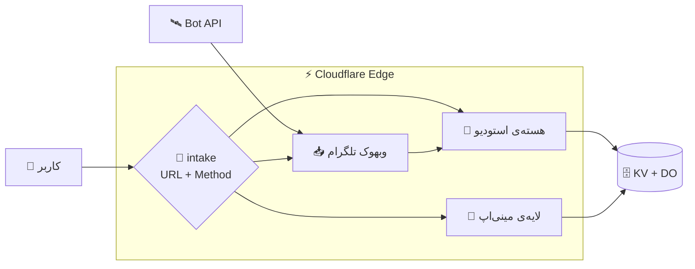
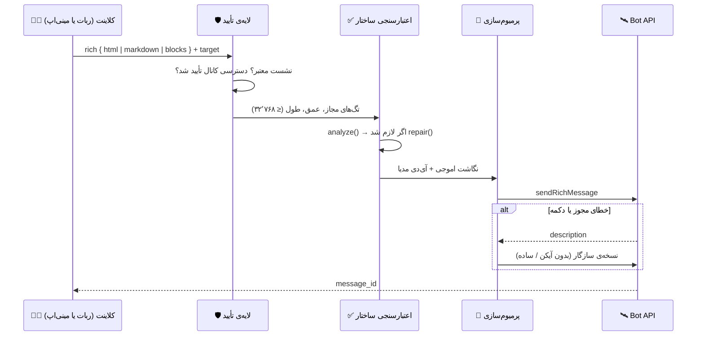
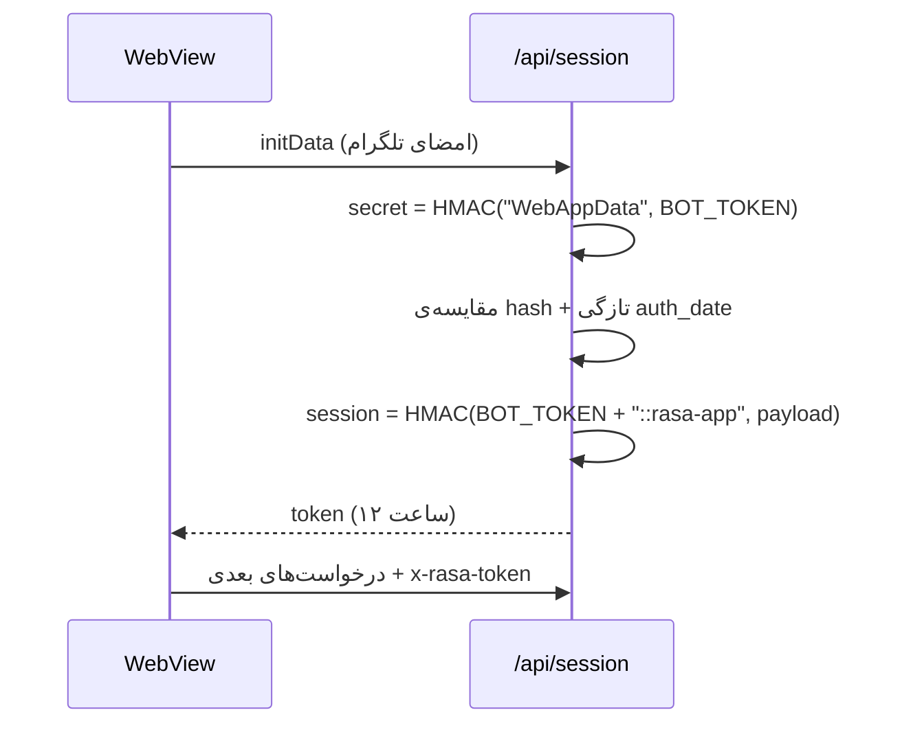

# 🏗 معماری رِسا — Architecture

> یک ورکر، سه لایه، دو رابط. این سند دقیقاً می‌گوید هر قطعه کجا نشسته و چرا.

---

## ۱. تصویر کلی



سه مسیر ورودی وجود دارد و هیچ‌کدام دیگری را قفل نمی‌کند:

| ورودی | مسیر | مسئول |
|---|---|---|
| کاربر وب | `/` ، `/worker.js` ، `/api/send` | هسته‌ی استودیو |
| مینی‌اپ | `/app` ، `/assets/*` ، `/api/*` | لایه‌ی مینی‌اپ |
| تلگرام | `/telegram/webhook` | پردازشگر آپدیت |

---

## ۲. روتر افزایشی

لایه‌ی مینی‌اپ قبل از هسته بررسی می‌شود؛ اگر مسیر مال او نبود، `null` برمی‌گرداند و هسته پاسخ می‌دهد:

```js
export default {
  async fetch(request, env, ctx) {
    const url = new URL(request.url);

    const rasa = await tryRasaApp(request, env, ctx, url).catch(() => null);
    if (rasa) return rasa;          // /app ، /assets/* ، /api/*

    return core(request, env, ctx); // هسته‌ی پایدار — دست‌نخورده
  }
};
```

**چرا این الگو؟** چون هسته‌ای که ماه‌ها در حال کار است نباید برای افزودن یک UI وب بازنویسی شود. مرزِ بین دو لایه فقط یک تابع است.

---

## ۳. چرخه‌ی انتشار



نردبان افتادن در `rich/send.js` پیاده شده و ترتیبش این است:

```
1. sendRichMessage + آیکن اموجی روی دکمه‌ها
2. sendRichMessage بدون icon_custom_emoji_id
3. نسخه‌ی ساده (متن + کیبورد کلاسیک)
4. DM موقت + copyMessage به کانال (برای اموجی پرمیوم در کانال)
```

### ویرایش پیام: دو مسیر، یک قاعده

هر پست در چت یک پیام زنده است و همه‌ی دکمه‌ها همان پیام را ویرایش می‌کنند. تلگرام دو API جدا دارد:

| نوع پیام | متد ویرایش | کجا استفاده می‌شود |
|---|---|---|
| متنی / ریچ | `editMessageText` | پست بدون رسانه |
| مدیایی (عکس، ویدیو، …) | `editMessageCaption` | بعد از افزودن عکس یا ویدیو |

قاعده‌ی عملی: هر ویرایشی که به پیام مدیایی بخورد باید کپشن را عوض کند، وگرنه تلگرام با
«there is no text in the message to edit» رد می‌کند. لایه‌ی ویرایش (`editPostMessage`) همین را
خودکار تشخیص می‌دهد: اگر مسیر متنی رد شود، خودش به نردبانِ کپشن می‌رود (HTML → بدون آیکن → متن ساده)
تا کیبورد در همه‌ی حالت‌ها زنده بماند.

---

## ۴. لایه‌ی حافظه

سه فضای KV با چرخه‌ی عمر متفاوت + یک Durable Object برای خواندن/نوشتن سازگار:

| فضا | نوع داده | چرا جدا است |
|---|---|---|
| `KV` | دیتابیس اموجی، کانال‌ها، برند، زمان‌بندی، اعتبار، کلید AI | داده‌ی کم‌تغییر و پرخوان |
| `KV_FRESH` | پست‌ها، پیش‌نویس‌ها، قالب‌ها، کتابخانه‌ی رسانه | داده‌ی پرتغییر کاربر |
| `RASA_KV` | `app.html` و دارایی‌های استاتیک | فایل‌های دودویی با کش بلند |
| `STATE` (DO) | وضعیت مکالمه و کلیدهای حساس به ترتیب | سازگاری قوی |

```js
// store.js — الگوی نام‌گذاری کلیدها
await store.put(`st:${uid}`, state);              // وضعیت مکالمه
await store.get(`d:${uid}:index`, { items: [] }); // ایندکس پیش‌نویس‌ها
await store.put(`m:${uid}`, { items: media });    // کتابخانه‌ی رسانه
await store.get(`invites:${uid}`, freshInvite()); // اعتبار و دعوت‌ها
```

هر نوشتن روی DO اول تلاش می‌شود و در صورت خطا به KV می‌افتد؛ همین باعث می‌شود رفتار در پلن رایگان هم پایدار بماند.

---

## ۵. احراز هویت مینی‌اپ



سه لایه‌ی دفاعی: امضای تلگرام، توکن نشست با عمر کوتاه، و بررسی مالکیت داده (`uid` از خود توکن خوانده می‌شود، نه از بدنه‌ی درخواست).

---

## ۶. زمان‌بندی

هر کاربر صف خودش را دارد و یک ایندکس جهانی نگه داشته می‌شود:

```
sched:<uid>      → { jobs: [ { id, target, html, scheduledAt, status } ] }
sched_global     → { ids: [ { id, uid, at } ] }
```

کارهای رسیده در همان درخواست `/api/schedule/list` (تخلیه‌ی تنبل) و همچنین با cron اجرا می‌شوند. مزیت: بدون سرویس بیرونی، بدون دیتابیس صف، و خطا در یک کار بقیه را متوقف نمی‌کند.

---

## ۷. مرزها و قواعد تغییر

| می‌خواهی… | کجا دست ببر |
|---|---|
| قابلیت جدید در ربات (دستور، دکمه، فلوی گفتگو) | هسته + `flows/` |
| اندپوینت جدید برای مینی‌اپ | `src/miniapp.js` + `glue.js` (فقط الگوی مسیر) |
| بلوک یا دستور زبان ریچ تازه | `rich/kit.js` + `rich/validate.js` |
| رفتار اموجی پرمیوم | `emoji/index.js` |
| رابط کاربری استودیو | `miniapp/app.html` (تک‌فایل) |

**قاعده‌ی طلایی:** هیچ‌وقت مسیرهای `/`، `/api/send` و `/webhook` را تغییر نده. آن‌ها قرارداد عمومی پروژه‌اند و چندین نسخه از کلاینت‌ها رویشان حساب می‌کنند.

---

## ۸. چرا این ساختار؟

- **بدون بیلد:** نه باندلری در مسیر اجرا، نه مرحله‌ی کامپایل. ورکر و مینی‌اپ هر دو فایل‌های مستقیم‌اند.
- **بدون دیتابیس:** KV کافی است چون الگوی دسترسی «کلید → سند JSON» است، نه کوئری رابطه‌ای.
- **بدون سرور:** پلن رایگان Cloudflare برای یک ربات پرمصرف کافی است و سطح حمله کوچک می‌ماند.
- **قابل بازگشت:** هر انتشار یک بسته‌ی مستقل است؛ برگشت با آپلود نسخه‌ی قبلی انجام می‌شود (بخش «برگرداندن نسخه» در `DEPLOYMENT.md`).
