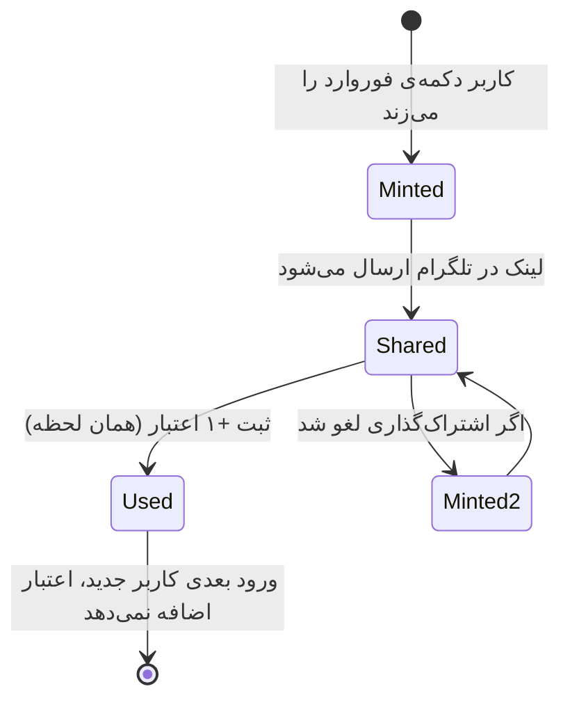

# 🎁 سیستم اعتبار، دعوت و فوروارد

> اعتبار یعنی «انتشار بدون امضا». هر پست بدون دکمه‌ی «رِسا ✨» یک اعتبار مصرف می‌کند.

---

## جدول قواعد

| کنش | پاداش | محدودیت |
|---|---|---|
| ورود کاربر با **لینک دعوت** (`start=ref_<uid>`) | `+۲` برای دعوت‌کننده، `+۲` برای کاربر تازه | هر کاربر فقط یک‌بار برای هر دعوت‌کننده؛ خود-دعوت ممنوع |
| **فوروارد کردن لینک** (`start=f_<uid>_<token>`) | `+۱` همان لحظه‌ی فوروارد | توکن یک‌بارمصرف، سقف ۲۰ در روز، فاصله‌ی ۱۰ ثانیه |
| ورود کاربر از **لینک فوروارد** | همان `+۱` (اگر توکن هنوز مصرف نشده باشد) | برای هر توکن فقط یک‌بار |
| حفظ امضای «رِسا» روی پست | `+۱` به ازای هر ۵ پست | خودکار |

---

## چرخه‌ی عمر توکن فوروارد



توکن‌ها ۳۰ روز عمر می‌کنند و سقف ۲۴ توکن مصرف‌نشده برای هر کاربر نگه داشته می‌شود تا سند KV بی‌اندازه بزرگ نشود.

---

## چرا این طراحی؟

مسئله این بود: **تلگرام اعلام نمی‌کند که یک لینک برای چه کسی فوروارد شده.** هیچ رویدادی برای آن وجود ندارد. پس دو مسیر برای تأیید باقی می‌ماند:

1. کاربر بگوید فوروارد کرد (مبتنی بر کلاینت، در همان لحظه)
2. کسی از لینک وارد ربات شود (قابل تأیید سمت سرور)

طراحی این‌طور است که **هر دو مسیر یک توکن را مصرف می‌کنند**:

- اگر اول مسیر ۱ رخ داد → `+۱` ثبت، توکن می‌سوزد، ورود بعدی اعتباری اضافه نمی‌کند.
- اگر اول مسیر ۲ رخ داد → `+۱` ثبت، توکن می‌سوزد، اشتراک‌گذاری بعدی دوباره حساب نمی‌شود.

نتیجه: هر فوروارد **حداکثر یک اعتبار** می‌دهد، از هر مسیری که اول برسد — و اگر اشتراک‌گذاری لغو شود، اعتبار سوخت نمی‌شود.

---

## ساختار داده

```json
{
  "invites:<uid>": {
    "credits": 3,
    "total": 7,
    "used": 2,
    "sigKept": 12,
    "invited": ["111", "222"],
    "forwards": ["-1001234"],
    "fwdTokens": [ { "t": "a1b2c3d4e5f60718", "at": 1790690000000, "used": 1 } ],
    "fwdLog": { "day": "2026-09-29", "n": 4, "last": 1790690100000, "mintAt": 1790690090000 }
  },
  "ref:<invitee>": { "inviter": "<uid>", "at": 1790690000000, "kind": "invite" },
  "fwd:<invitee>": { "inviter": "<uid>", "at": 1790690000000, "kind": "forward" }
}
```

- `ref:` و `fwd:` **اثرانگشت یک‌بارمصرف** هستند؛ وجودشان یعنی این کاربر قبلاً برای این نوع لینک حساب شده.
- `fwdLog.day` هر روز صفر می‌شود؛ `last` و `mintAt` فاصله‌ی زمانی را کنترل می‌کنند.

---

## اندپوینت‌ها

| مسیر | بدنه | پاسخ |
|---|---|---|
| `POST /api/invite/status` | — | `credits, total, invited, forwards, fwdDay, fwdDayLimit, fwdCooldownSec` |
| `POST /api/invite/fwd-token` | — | `token, link, fwdDay, fwdDayLimit` |
| `POST /api/invite/fwd-credit` | `{ token }` | `credits, fwdDay, fwdDayLimit` یا خطای `409/429` با پیام فارسی |
| `POST /api/invite/forward` | `{ target }` | نسخه‌ی قدیمی ثبت با آیدی چت (سازگاری عقب‌رو) |

---

## سمت ربات

هنگام `/start` پارامتر بررسی می‌شود:

```
/start ref_<uid>              → دعوت: +۲ دعوت‌کننده، +۲ کاربر تازه
/start f_<uid>_<token>        → فوروارد: +۱ (فقط اگر توکن مصرف نشده باشد)
/start <uid>  |  /start r<uid> → قالب‌های قدیمی، پشتیبانی می‌شوند
```

اگر ربات پیام فورواردشده‌ای ببیند که داخلش لینک `f_…_<token>` باشد (مثلاً در گروهی که عضو است)، همان توکن را مصرف و اعتبار را ثبت می‌کند — با تضمین اینکه دوباره‌شماری رخ ندهد.
