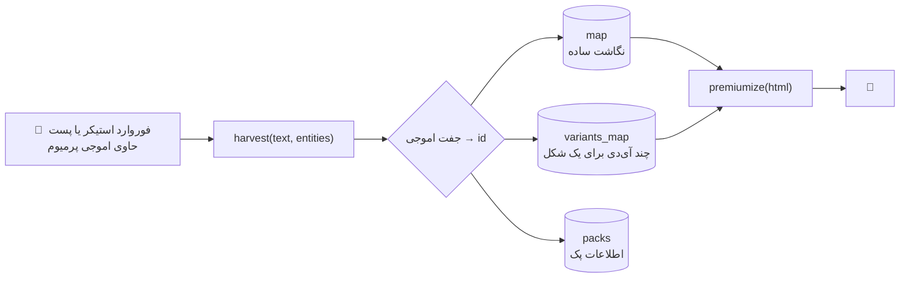

# 🍉 موتور اموجی پرمیوم

هدف: هر اموجی داخل متن، پیش از ارسال به یک **اموجی پرمیوم تلگرام** تبدیل شود — بدون اینکه کاربر لازم باشد چیزی از آی‌دی‌ها بداند.

---

## ۱. جریان کلی



---

## ۲. چرا دو حالت برای هر اموجی؟

تلگرام یک اموجی را می‌تواند با یا بدون **VS16** بفرستد: `⚡` و `⚡️` از نظر بایت متفاوت‌اند ولی یک اموجی‌اند. موتور هر دو حالت را نگه می‌دارد:

```js
const strip = (s) => String(s).replace(/\uFE0F/g, '');
const variants = (e) => [...new Set([strip(e), strip(e) + '\uFE0F', e])];
```

نتیجه: کاربر هر شکلی را تایپ کند، جایگزینی انجام می‌شود.

---

## ۳. پرمیوم‌سازی

```js
// ساده‌شده
html.replace(emojiRegex, (ch) => {
  const id = map[ch] || map[strip(ch)] || variantsMap[ch]?.[0];
  return id ? `<tg-emoji emoji-id="${id}">${ch}</tg-emoji>` : ch;
});
```

- اگر آی‌دی پیدا نشود، اموجی دست‌نخورده می‌ماند (هیچ‌وقت متن خراب نمی‌شود).
- روی دکمه‌ها هم `icon_custom_emoji_id` ست می‌شود.

---

## ۴. نردبان امن برای کانال

قانون Bot API 9.4: اموجی پرمیوم در کانال فقط از راه **کپی از یک پیام در DM** قابل استفاده است (اگر مالک پرمیوم داشته باشد). ربات این را خودکار مدیریت می‌کند:

```
post در DM (با اموجی) → copyMessage به کانال → پاک کردن پیام موقت DM
```

اگر کپی مجاز نباشد، نسخه‌ی ساده (بدون اموجی پرمیوم) ارسال می‌شود تا پست از دست نرود.

---

## ۵. اعداد نسخه‌ی زنده

| مورد | مقدار |
|---|---|
| نگاشت اموجی | ۱٬۶۰۰+ |
| پک‌های شناسایی‌شده | ۲۵ |
| ایندکس سمت مینی‌اپ | ۴۹۳ کد کوتاه + ۲۴۶ واریانت |
| بافر تصویر | `immutable, max-age=31536000` در لبه |

---

## ۶. افزودن پک تازه

فقط یک استیکر از پک را به ربات فوروارد کن. ربات `getStickerSet` را می‌خواند، همه‌ی اموجی‌های پرمیوم پک را برداشت می‌کند و در `map`/`variants_map`/`packs` می‌نویسد. پک‌های ذخیره‌شده در استودیو هم قابل مرور و انتخاب‌اند.
