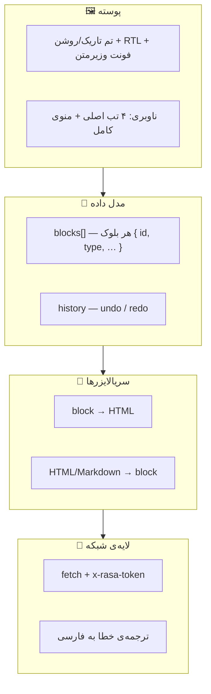
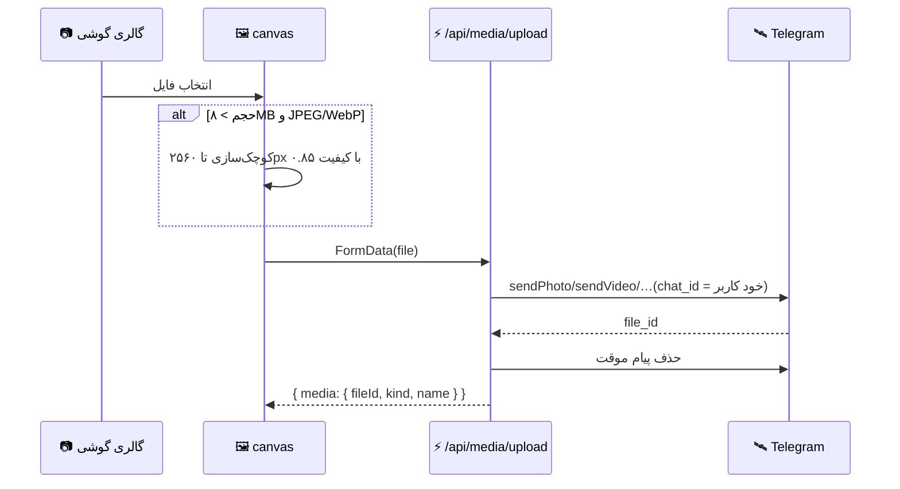

# 📱 آناتومی مینی‌اپ

مینی‌اپ «رِسا» یک **فایل HTML واحد** است که از KV سرو می‌شود: بدون باندلر، بدون فریم‌ورک، بدون مرحله‌ی ساخت.

```
GET /app → RASA_KV["asset:app.html"] → 200 (cache-control: no-store)
```

---

## ۱. نمای کلی لایه‌ها



---

## ۲. مدل بلوک: منبع حقیقت

هر بلوک یک شیء کوچک است:

| `type` | فیلدها |
|---|---|
| `text` | `t` (HTML درون‌خطی مجاز) |
| `heading` | `t` |
| `list` | `t` + `ord` |
| `quote` | `t` |
| `details` | `s` (عنوان) + `t` |
| `table` | `rows[][]` |
| `formula` | `t` (TeX) |
| `media` | `kind`, `fileId`, `name` |
| `buttons` | `align` + `rows[][]` |
| `raw` | `t` (HTML کامل) |
| `product` / `price` / `countdown` / `poll` | دستور زبان آماده (`raw`) |

مارک‌آپ درون‌خطی طبق همان زبانی است که ربات می‌فهمد (`<b>`, `<i>`, `<a href>`, `<code>`, `<tg-emoji>`) — پس آنچه در ادیتور می‌بینی، همان چیزی است که منتشر می‌شود.

---

## ۳. سه مسیر تبدیل

```
        parse          render
HTML ──────────▶ blocks ──────────▶ HTML
Markdown ──────▶   ▲
                   └── ویرایش دستی در ادیتور
```

- **ورودی:** هر متنی که کاربر پیست کند (Markdown، HTML یا ترکیبی) تحلیل و به بلوک شکسته می‌شود.
- **خروجی:** همان بلوک‌ها دوباره به HTML تلگرام تبدیل می‌شوند.
- **مزیت:** کاربر می‌تواند وسط کار بین حالت «تصویری» و «کد» جابه‌جا شود؛ هیچ‌چیز گم نمی‌شود.

---

## ۴. پیش‌نمایش زنده

پیش‌نمایش دقیقاً از همان تابع رندرِ خروجی استفاده می‌کند؛ یعنی تفاوت میان «آنچه می‌بینی» و «آنچه منتشر می‌شود» فقط در حد قالب تلگرام است، نه در ساختار.

- شبیه‌ساز موبایل/دسکتاپ برای دیدن رفتار دکمه‌ها
- تم تاریک/روشن همراستا با تم تلگرام
- رندر فرمول با KaTeX (داخل خود فایل)

---

## ۵. خط لوله‌ی رسانه



- آپلود روی چت خودِ کاربر انجام می‌شود تا `file_id` در همان ربات معتبر بماند و بعد از آن پیام موقت پاک می‌شود.
- در انتشار، فقط `file_id` به تلگرام فرستاده می‌شود؛ نه فایل دوباره.
- سقف‌ها قبل از آپلود در مرورگر بررسی می‌شوند تا پهنای باند هدر نرود.

---

## ۶. کتابخانه و پیش‌نویس

| قابلیت | جزئیات |
|---|---|
| جستجو | روی عنوان، تگ، پوشه و متن |
| برچسب‌گذاری | تگ‌ها با کاما، تا ۱۰ تگ |
| پوشه | رشته‌ی کوتاه، تا ۳۰ کاراکتر |
| ستاره | علاقه‌مندی برای پیدا کردن سریع |
| قالب | ۶ قالب آماده + قالب‌های شخصی |

---

## ۷. استودیوی هوش مصنوعی

```
کلید + آدرس سازگار با OpenAI ──▶ «تست اتصال»
        │                              │
        │                              ├─ خواندن /models
        │                              ├─ فیلتر مدل‌های غیرنویسنده
        │                              ├─ انتخاب بهترین مدل
        │                              └─ ذخیره‌ی خودکار
        ▼
«تولید پست» ──▶ پرامپت سیستمی بر اساس سبک ──▶ HTML آماده ──▶ درج در ادیتور
```

سبک‌های آماده: ویروسی، رسمی، محصولی، استاندارد. اگر کلیدی ثبت نشده باشد، اپ یک قالب ساده‌ی محلی می‌سازد تا جریان کار قطع نشود.

---

## ۸. دسترس‌پذیری و جزئیات ریز

- همه‌ی دکمه‌ها با `aria-label` و ناحیه‌ی لمس ≥ ۴۴px
- بازخورد لمسی (`HapticFeedback`) روی کنش‌های مهم
- حالت «نمایشی» بدون سرور: همه‌ی نماها کار می‌کنند، فقط نوشتن غیرفعال است
- کش‌شکنی: `app.html` با `no-store` سرو می‌شود تا آپدیت فوری باشد
